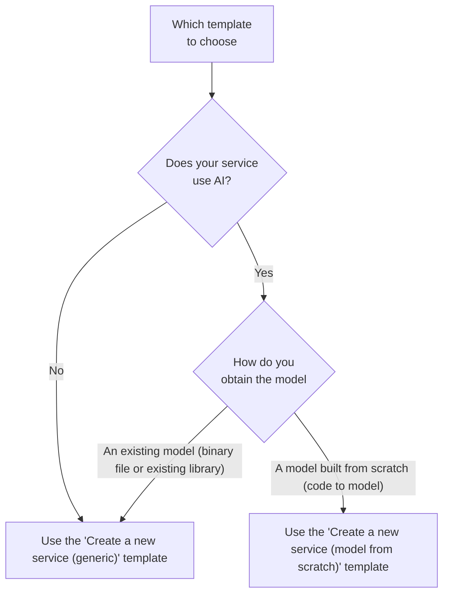

# How to create a new service

This guide will help you in the steps to create a new service for the
[Core engine](../reference/core-engine.md).

## Follow the official tutorials

If you have not already, we highly recommend you to follow the two official
tutorials to learn how to create a new service:

- [Rotate an image](TODO) - Uses the _Create a new service (generic)_ template
  mentioned below
- [Summarize a text using an existing model](TODO) - Uses the _Create a new
  service (generic)_ template mentioned below
- [Detect anomalies using a model built from scratch](TODO) - Uses the _Create a
  new service (model from scratch)_ template mentioned below

## Choose a template

We have built two [Python](../explanations/about-python.md) +
[FastAPI](../explanations/about-fastapi.md) templates that you can use to
quickly bootstrap a new service:

- [Create a new service (generic) template](https://github.com/swiss-ai-center/create-a-new-service-generic-template)
- [Create a new service (model from scratch) template](https://github.com/swiss-ai-center/create-a-new-service-model-from-scratch-template)

To help you choose the right template, the following flow diagram can help you
decide the right template for your use case.



## Bootstrap a new service based on the chosen template

Once you have chosen the right template for your use-case, you can create a new
service based on the chosen template. You have three ways to bootstrap a new
service based on the chosen template:

=== "Use the template"

    If you are part of the Swiss AI Center GitHub organization, this is the
    recommended way to bootstrap a new service.

    You can directly use the "Use the template" button to create a new repository
    based on the chosen template.

=== "Fork the template"

    If you are not part of the Swiss AI Center GitHub organization, this is the
    recommended way to bootstrap a new service.

    Fork the template to fork a new repository based on the chosen template.

=== "Download the template"

    If you do not want to host your codebase on GitHub or if you do not want to be
    linked to the Swiss AI Center organization, you can download the template as an
    archive file (ZIP or GZIP) from the GitHub repository and start over locally or
    in a new Git repository.

## Implement your service

Follow the instructions mentioned in the template you just bootstrapped to
implement your service with your own logic/model.

## Test your service

We highly recommend to test your service locally by starting the Core engine,
registering your service and trying your service from end-to-end.

To ensure the service can run correctly, run the following commands:

```sh
# Build the Docker image
docker compose build

# Start the Docker container
docker compose up
```

Access the service at <http://localhost:8080> and validate everything works as
intended.

## Publish your service

Once your service is implemented and you validated it works as intended, you can
publish your service to a container registry such as GitHub Container Registry
with the help of [Docker](../explanations/about-docker-and-docker-compose.md)
and [Docker Compose](../explanations/about-docker-and-docker-compose.md).

If you do not want to publish your service, you can skip this section.

=== "Using a CI/CD pipeline"

    If you use GitHub or GitLab (TODO), the template provides all the configuration
    files to publish your service using a CI/CD pipeline.

    === "GitHub"

        Add the following environment variables to enable the CI/CD pipeline:

        - `ENABLE_PUBLISHING`: true

        Add the following secrets to enable the CI/CD pipeline:

        - `TODO`: TODO

    === "GitLab"

        Add the following variables to enable the CI/CD pipeline:

        - `ENABLE_PUBLISHING`: true

=== "Manually"

    To publish the service with Docker and Docker Compose manually, start by copying
    the `.env.example` to `.env`.

    Edit the `.env` file to change the name of the image to the right name stated by
    your container registry (usually based on the repository name). More information
    here:

    - TODO

    Login to the container registry using the `docker login` command. More
    information here:

    - TODO

    Build and publish the Docker image using the following commands:

    ```sh
    # Build the Docker image
    docker compose build

    # Publish the Docker image
    docker compose push
    ```

    If everything went right, your service should be successfully published to the
    container registry.

## Deploy your service

Once your service is published, you can deploy it using one of the following
ways to deploy your new model:

=== "Using Kubernetes"

    This is the recommended method to deploy your service in a production
    environment. A published Docker image is required.

    === "Using a CI/CD pipeline"

        If you use GitHub or GitLab (TODO), the template provides all the configuration
        files to deploy your service using a CI/CD pipeline.

        === "GitHub"

            Add the following environment variables to enable the CI/CD pipeline:

            - `ENABLE_DEPLOYING`: true

            Add the following secrets to enable the CI/CD pipeline:

            - `TODO`: TODO

        === "GitLab"

            Add the following variables to enable the CI/CD pipeline:

            - `ENABLE_DEPLOYING`: true

    === "Manually"

        Edit the `stateful.yml` configuration file to use the URL of the published
        image. Edit the `ingress.yml` configuration file to make usage of your own
        domain name for the service.

        Apply the configuration files with the help of
        [kubectl](../explanations/about-kubectl.md).

=== "Using Docker Compose"

    This is the recommended method to deploy your service in a development/testing
    environment.

    === "Docker Compose using the published image"

        To deploy the service with Docker and Docker Compose using the published image,
        start by copying the `.env.example` to `.env`.

        Edit the `.env` file to change the name of the image to the URL of the published
        image.

        Deploy the service with the following command

        ```sh
        # Pull the Docker image from the container registry
        docker compose pull

        # Start the Docker container
        docker compose up
        ```

    === "Docker Compose using the local image"

        To deploy the service with Docker Compose using the local image with the
        following commands:

        ```sh
        # Build the Docker image
        docker compose build

        # Start the Docker container
        docker compose up
        ```

## Frequently asked questions

### Which framework/language to use

Any framework/language can be used to create a new service compatible with the
Core engine as long as it follows the
[specifications](../reference/core-concepts/service.md/#specifications) of the
Swiss AI Center project.

The chosen framework/language must be able to receive/make requests on some HTTP
endpoints.

In all Swiss AI Center's services, we have chosen to use
[Python](../explanations/about-python.md) with the help of
[FastAPI](../explanations/about-fastapi.md).

### Where to host the service's code

It is not mandatory to host the service's code to use the Core engine.

If you want to host the service's code, we recommend Git with the help of
[GitHub](../explanations/about-github.md).

### Where to host the service's model code

!!! info

    This only applies to services that uses a machine learning model.

It is not mandatory to host the service's model code to use the Core engine.

If you want to host the service's model code, we recommend Git with the help of
[GitHub](../explanations/about-github.md).

### Where to host the service's model data

!!! info

    This only applies to services that uses a machine learning model built from
    scratch.

It is not mandatory to host the service's model data to use the Core engine.

If you want to host the service's model data, we recommend
[DVC](../explanations/about-dvc.md) with the help of Git and
[GitHub](../explanations/about-github.md).
