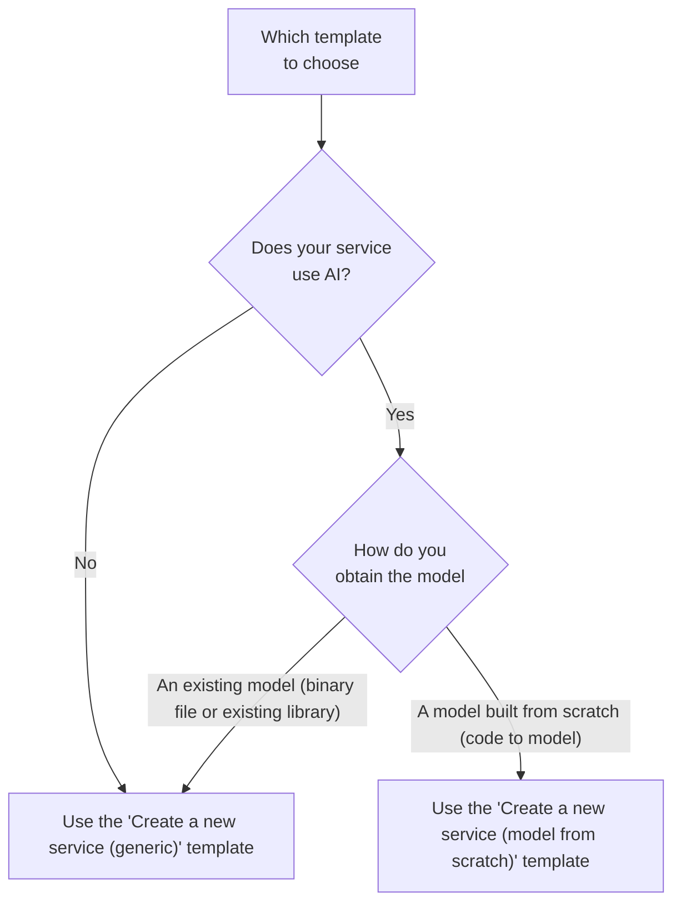

# How to create a new service

This guide will help you in the steps to create a new service for the
[Core engine](../reference/core-engine.md).

## Follow the official tutorials

If you have not already, we highly recommend you to follow the two official
tutorials to learn how to create a new service:

- [Rotate an image (generic template)](../tutorials/create-a-service-to-rotate-an-image.md)
- [Summarize a text using an existing model (generic template)](../tutorials/create-a-service-to-summarize-a-text-using-an-existing-model.md)
- [Detect anomalies using a model built from scratch (model from scratch template)](../tutorials/create-a-service-to-detect-anomalies-using-a-model-built-from-scratch.md)

## Choose a template

We have built two [Python](../explanations/about-python.md) +
[FastAPI](../explanations/about-fastapi.md) templates that you can use to
quickly bootstrap a new service:

- [Create a new service (generic) template](https://github.com/swiss-ai-center/create-a-new-service-generic-template)
- [Create a new service (model from scratch) template](https://github.com/swiss-ai-center/create-a-new-service-model-from-scratch-template)

To help you choose the right template, the following flow diagram can help you
decide the right template for your use case.



## Bootstrap a new service based on the chosen template

Once you have chosen the right template for your use-case, you can create a new
service based on the chosen template. You have three ways to bootstrap a new
service based on the chosen template:

=== "Use the template"

    If you are part of the Swiss AI Center GitHub organization, this is the
    recommended way to bootstrap a new service.

    Use the "Use the template" button to create a new repository based on the chosen
    template.

=== "Fork the template"

    If you are not part of the Swiss AI Center GitHub organization, this is the
    recommended way to bootstrap a new service.

    Fork the template to fork a new repository based on the chosen template.

=== "Download the template"

    If you do not want to host your codebase on GitHub or if you do not want to be
    linked to the Swiss AI Center organization, you can download the template as an
    archive file (_"Download ZIP"_) from the GitHub repository and start over
    locally or in a new Git repository.

## Implement your service

Follow the instructions mentioned in the template you just bootstrapped to
implement your service with your own logic/model.

## Test your service

We highly recommend to test your service locally by starting the Core engine,
registering your service and trying your service from end-to-end.

To ensure the service can run correctly, run the following commands:

```sh
# Build the Docker image
docker compose build

# Start the Docker container
docker compose up
```

Access the service at <http://localhost:8080> and validate everything works as
intended.

## Build, publish and deploy your service

Once your service is implemented and you validated it works as intended, you can
publish your service to a container registry such as GitHub Container Registry
with the help of [Docker](../explanations/about-docker-and-docker-compose.md)
and [Docker Compose](../explanations/about-docker-and-docker-compose.md) using
the
[How to build, publish and deploy a service](./how-to-build-publish-and-deploy-a-service.md)
guide.

If you do not want to publish your service, you can skip this section.

## Frequently asked questions

### Which framework/language to use

Any framework/language can be used to create a new service compatible with the
Core engine as long as it follows the
[specifications](../reference/core-concepts/service.md#specifications) of the
Swiss AI Center project.

The chosen framework/language must be able to receive/make requests on some HTTP
endpoints.

In all Swiss AI Center's services, we have chosen to use
[Python](../explanations/about-python.md) with the help of
[FastAPI](../explanations/about-fastapi.md).

### Where to host the service's code

It is not mandatory to host the service's code to use the Core engine.

If you want to host the service's code, we recommend Git with the help of
[GitHub](../explanations/about-github.md).

### Where to host the service's model code

!!! info

    This only applies to services that uses a machine learning model.

It is not mandatory to host the service's model code to use the Core engine.

If you want to host the service's model code, we recommend Git with the help of
[GitHub](../explanations/about-github.md).

### Where to host the service's model data

!!! info

    This only applies to services that uses a machine learning model built from
    scratch.

It is not mandatory to host the service's model data to use the Core engine.

If you want to host the service's model data, we recommend
[DVC](../explanations/about-dvc.md) with the help of Git and
[GitHub](../explanations/about-github.md).
