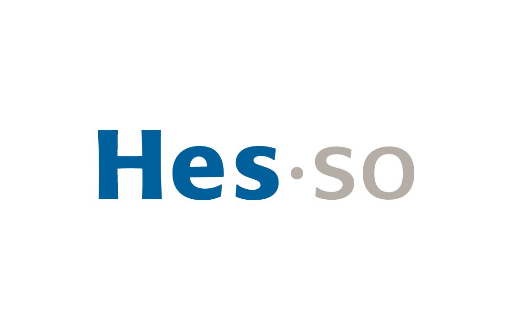

# Swiss AI Center

## Introduction

Welcome to the Swiss AI Center Documentation website !

> The mission of the Swiss AI Center is to accelerate the adoption of artificial
> intelligence in the digital transition of Swiss SMEs. The associated
> socio-economic challenge is to increase their competitiveness, limit
> relocation and create new skills at the interface between laboratories and the
> practical use of artificial intelligence. - [Swiss AI Center website](https://swiss-ai-center.ch)

The documentation is separated in the following axes:

- [Tutorials](./tutorials/index.md) - Follow guided tutorials to better
  understand the Swiss AI Center project
- [How-to guides](./how-to-guides/index.md) - Learn how to create/improve new
  services compatible with the Swiss AI Center
- [Reference](./reference/index.md) - All the projects we manage at the Swiss AI
  Center
- [Explanations](./explanations/index.md) - Explanations about the choices/tools
  we chose in the Swiss AI Center project

## Getting started

Don't know where to start? Check these first!

- [About Swiss AI Center](https://swiss-ai-center.ch)
- [Getting started](./tutorials/getting-started.md)
- [About this documentation](./explanations/about-this-documentation.md)

<figure markdown>
  [{ width="300" }](https://www.hes-so.ch/swiss-ai-center){:target="\_blank"}
</figure>
