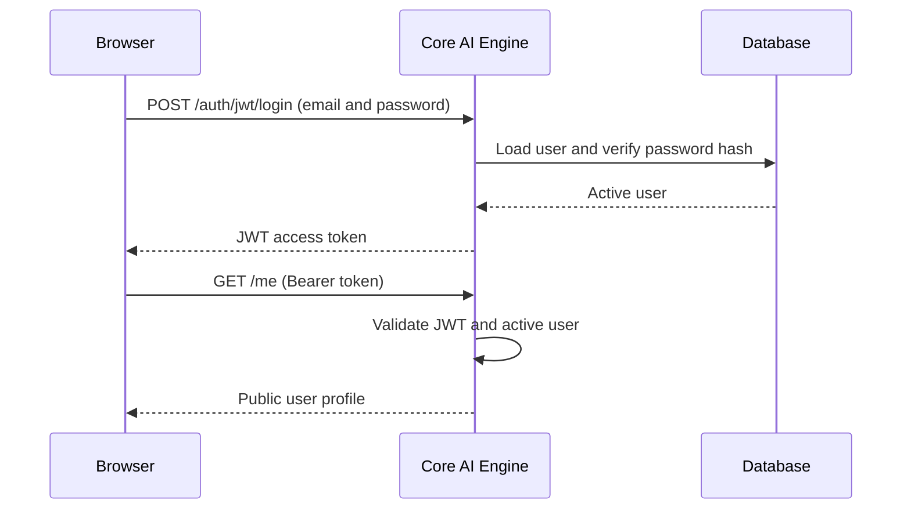

# Authentication and authorization

The Core AI Engine authenticates people with email and password credentials and
authorizes requests with two application roles: `user` and `admin`. It uses
[FastAPI Users](https://fastapi-users.github.io/fastapi-users/) to verify
passwords and issue JSON Web Tokens (JWTs).

Authentication is optional for the public service and pipeline catalogs. When a
valid bearer token is supplied, those same endpoints return the resources that
the user's role is allowed to access (see [services access level](service.md#access-levels)).

## Login and session lifecycle

The login endpoint accepts OAuth2 password form data. The `username` field
contains the user's email address.

```bash
curl -X POST "${ENGINE_URL}/auth/jwt/login" \
  -H "Content-Type: application/x-www-form-urlencoded" \
  --data-urlencode "username=user@example.com" \
  --data-urlencode "password=change-me"
```

A successful response contains an access token and the `bearer` token type.

```json
{
  "access_token": "<jwt>",
  "token_type": "bearer"
}
```

Send the token in the `Authorization` header when calling an authenticated
endpoint.

```bash
curl "${ENGINE_URL}/me" \
  -H "Authorization: Bearer ${ACCESS_TOKEN}"
```



The web application stores the token in browser `sessionStorage`. It restores
the session by calling `GET /me` after a page reload. Closing the browser tab or
window ends the browser session. Signing out calls `POST /auth/jwt/logout` and
removes the locally stored token.

!!! note

    JWTs are stateless. The current implementation has no refresh token or
    server-side token revocation store. An access token expires after the value
    configured by `AUTH_TOKEN_TTL`.

## User data

The public user representation contains:

| Field | Description |
| --- | --- |
| `id` | UUID that identifies the user. |
| `email` | Unique login email address. |
| `first_name` | User's first name. |
| `last_name` | User's last name. |
| `role` | Either `user` or `admin`. |
| `address` | Optional billing address data. |

The password hash is stored only on the database model and is never included in
an API response.

## Roles

| Role | Permissions |
| --- | --- |
| `user` | Use public and user-level services and pipelines, and manage their own name. |
| `admin` | All user permissions, administrator endpoints, and admin-level services and pipelines. |

An endpoint that requires authentication returns `401 Unauthorized` when the
token is missing, invalid or belongs to an inactive user. An administrator-only
endpoint returns `403 Forbidden` when a valid `user` token is supplied.

## Authentication endpoints

| Method | Endpoint | Access | Purpose |
| --- | --- | --- | --- |
| `POST` | `/auth/jwt/login` | Public | Exchange an email and password for a bearer token. |
| `POST` | `/auth/jwt/logout` | Authenticated | Complete logout for the configured JWT backend. |
| `GET` | `/me` | Authenticated | Return the current user's profile. |
| `PATCH` | `/me` | Authenticated | Update the current user's first and last names. |
| `GET` | `/admin/users` | Admin | List all users, ordered by email. |
| `PATCH` | `/admin/users/{user_id}/role` | Admin | Promote a user to `admin` or downgrade one to `user`. |

The body for `PATCH /me` contains both names. Values are trimmed and must each
contain between 1 and 100 characters.

```json
{
  "first_name": "Ada",
  "last_name": "Lovelace"
}
```

The role update endpoint accepts one of the two application roles.

```json
{
  "role": "admin"
}
```

## Administrator bootstrap

The Core AI Engine can create the first administrator during application
startup. Configure both environment variables:

| Variable | Description |
| --- | --- |
| `ADMIN_EMAIL` | Email address of the initial administrator. |
| `ADMIN_PASSWORD_HASH` | Pre-hashed password for that administrator. |

The startup hook creates an `Admin Admin` user only when both values are set and
no user with that email already exists. It does not replace an existing user or
password.

`AUTH_SECRET` is the private server-side key used to sign and validate JWTs. A
client cannot alter a token without invalidating its signature. Generate a
cryptographically random secret with OpenSSL:

```bash
openssl rand -hex 64
```

Store the result as `AUTH_SECRET`. `AUTH_TOKEN_TTL` controls the access-token
lifetime in seconds and defaults to 86400 seconds (24 hours).

Generate the value for `ADMIN_PASSWORD_HASH` interactively with the password
helper used by FastAPI Users:

```bash
uv run python -c "from fastapi_users.password import PasswordHelper; import getpass; print(PasswordHelper().hash(getpass.getpass()))"
```

The command asks for the password without placing the plaintext value in the
shell command or output. Copy only the generated hash into
`ADMIN_PASSWORD_HASH`.

!!! warning

    Keep `AUTH_SECRET` and the administrator password hash in a secret store. Do not
    commit either value to the repository.

## Resource access levels

Authentication also controls discovery and execution of services and pipelines.
See [service access levels](service.md#access-levels) and
[pipeline access](pipeline.md#access-control) for the complete rules.

## Current limitations

- Self-registration is not enabled. The web interface displays a disabled
  **Register (soon)** action as a placeholder.
- Email verification, password reset and refresh-token routes are not exposed.
- First and last names can be edited, but email and address editing are not
  available in the web interface.
