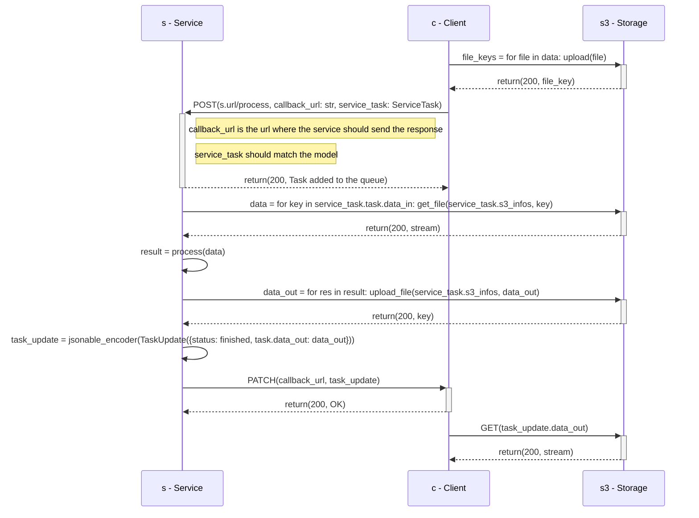
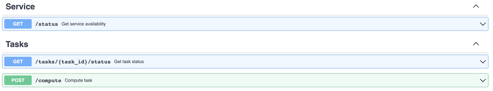

# Service

This page describes the service architecture and its specifications.

The service is a [FastAPI](https://fastapi.tiangolo.com/) application that is
deployed on a Kubernetes cluster. It is a REST API that can be used to process
data.

## Architecture

To see the general architecture of the project, see the global
[UML Diagram](../core-engine.md#uml-diagram).

This sequence diagram illustrates the interaction between an user and a service,
without using the Core engine.



## Specifications

Inside the project, the services are implemented using Python. But the service
is a REST API, so it can be implemented in any language.

### Endpoints

To match the specifications, the service must implement the following endpoints:

- GET `/status` : returns the service availability. (Returns a string)
- GET `/tasks/{task_id}/status` : returns the status of a task. (Returns a
  string)
- POST `/compute` : computes the given task and returns the result. (Returns a
  string)



### Models

The different models used in the pipeline are described below.

#### Task Input

The `POST /compute` endpoint must be able to receive a JSON body that matches
the following model:

```python
class ServiceTaskTask(BaseModel):
    """
    Task update model
    This model is used to update a task
    """
    id: UUID
    data_in: List[str]
    data_out: List[str] | None = None
    status: TaskStatus
    service_id: UUID
    pipeline_execution_id: UUID | None = None


class ServiceTaskBase(BaseModel):
    """
    Base class for Service task
    This model is used in subclasses
    """

    s3_access_key_id: str
    s3_secret_access_key: str
    s3_region: str
    s3_host: str
    s3_bucket: str
    task: ServiceTaskTask
    callback_url: str
```

The `data_in` and `data_out` fields are lists of S3 object keys. The `status`
field is a string that can be one of the following values:

```python
class TaskStatus(str, Enum):
    PENDING = "pending"
    FETCHING = "fetching"
    PROCESSING = "processing"
    SAVING = "saving"
    FINISHED = "finished"
    ERROR = "error"
    SCHEDULED = "scheduled"
    SKIPPED = "skipped"
    UNAVAILABLE = "unavailable"
```

The S3 settings are used to connect to the S3 storage where the data is stored
and where the result will be stored. The `callback_url` is the url where the
service should send the response.

A JSON representation would look like this:

```json
{
  "s3_access_key_id": "access_key",
  "s3_secret_access_key": "secret_key",
  "s3_region": "eu-west-3",
  "s3_host": "test.s3.com",
  "s3_bucket": "test-bucket",
  "task": {
    "data_in": [
      "key1-in.png",
      "key2-in.json"
    ],
    "service_id": "3fa85f64-5717-4562-b3fc-2c963f66afa6",
    "pipeline_id": "45a85f64-5717-4562-b3fc-34a6f66afa6",
    "id": "76ba4e6a-3b8a-4bda-8407-6eaf5a8e1100"
  },
  "callback_url": "http://my-url.com/callback"
}
```

#### Task Output

Once the task is computed, the service must PATCH the task on `/tasks/{task_id}`
with the following model:

```python
class TaskUpdate(BaseModel):
    """
    Task update model
    This model is used to update a task
    """
    service: str | None = None
    url: str | None = None
    data_out: List[str] | None = None
    status: TaskStatus | None = None
```

The `data_out` field is a list of S3 object keys. The `status` field is a string
that can be one of the following values:

```python
class TaskStatus(str, Enum):
    PENDING = "pending"
    FETCHING = "fetching"
    PROCESSING = "processing"
    SAVING = "saving"
    FINISHED = "finished"
    ERROR = "error"
    SCHEDULED = "scheduled"
    SKIPPED = "skipped"
    UNAVAILABLE = "unavailable"
```

A JSON representation would look like this:

```json
{
  "service": "service-name",
  "url": "http://service-url",
  "data_out": [
    "key1-out.png",
  ],
  "status": "finished"
}
```

### Register to the Core engine

To register the service to the Core engine, the service must send a POST request
to the Core engine `/services` endpoint with the following model:

```python
class ExecutionUnitTagName(str, Enum):
    IMAGE_PROCESSING = "Image Processing"
    IMAGE_RECOGNITION = "Image Recognition"
    NATURAL_LANGUAGE_PROCESSING = "Natural Language Processing"
    ANOMALY_DETECTION = "Anomaly Detection"
    RECOMMENDATION = "Recommendation"
    TIME_SERIES = "Time Series"
    CLUSTERING = "Clustering"
    SEGMENTATION = "Segmentation"
    SPEECH_RECOGNITION = "Speech Recognition"
    DATA_PREPROCESSING = "Data Preprocessing"
    SENTIMENT_ANALYSIS = "Sentiment Analysis"
    NEURAL_NETWORKS = "Neural Networks"


class ExecutionUnitTagAcronym(str, Enum):
    IMAGE_PROCESSING = "IP"
    IMAGE_RECOGNITION = "IR"
    NATURAL_LANGUAGE_PROCESSING = "NLP"
    ANOMALY_DETECTION = "AD"
    RECOMMENDATION = "R"
    TIME_SERIES = "TS"
    CLUSTERING = "C"
    SEGMENTATION = "S"
    SPEECH_RECOGNITION = "SR"
    DATA_PREPROCESSING = "DP"
    SENTIMENT_ANALYSIS = "SA"
    NEURAL_NETWORKS = "NN"

class ExecutionUnitTag(TypedDict):
    """
    Service tag model
    """
    name: ExecutionUnitTagName
    acronym: ExecutionUnitTagAcronym
class ExecutionUnitStatus(Enum):
    AVAILABLE = "available"
    UNAVAILABLE = "unavailable"
    DISABLED = "disabled"

class ServiceBase(CoreModel):
    """
    Base class for a Service
    This model is used in subclasses
    """
    model_config = SettingsConfigDict(arbitrary_types_allowed=True)

    name: str = Field(nullable=False)
    slug: str = Field(nullable=False, unique=True)
    summary: str = Field(nullable=False)
    description: str | None = Field(default=None, nullable=True)
    status: ExecutionUnitStatus = Field(
        default=ExecutionUnitStatus.AVAILABLE, nullable=False
    )
    data_in_fields: List[FieldDescription] | None = Field(
        sa_column=Column(JSON), default=None
    )
    data_out_fields: List[FieldDescription] | None = Field(
        sa_column=Column(JSON), default=None
    )
    tags: List[ExecutionUnitTag] | None = Field(sa_column=Column(JSON), default=None)
    url: AnyHttpUrl = Field(sa_column=Column(String))
    has_ai: bool | None = Field(default=False, nullable=True)
```

The `data_in_fields` and `data_out_fields` fields are lists of
`FieldDescription` models. A `FieldDescription` model is defined as follows:

```python
class FieldDescriptionType(str, Enum):
    IMAGE_JPEG = "image/jpeg"
    IMAGE_PNG = "image/png"
    TEXT_PLAIN = "text/plain"
    TEXT_CSV = "text/csv"
    APPLICATION_JSON = "application/json"
    APPLICATION_PDF = "application/pdf"
    APPLICATION_ZIP = "application/zip"
    AUDIO_MP3 = "audio/mpeg"
    AUDIO_OGG = "audio/ogg"


class FieldDescription(TypedDict):
    """
    Field description model
    """
    name: str
    type: List[FieldDescriptionType]
```

The `url` field is the url of the service.

A JSON representation would look like this:

```json
{
  "name": "service-name",
  "slug": "service-slug",
  "url": "http://service-url",
  "summary": "service-summary",
  "description": "service-description",
  "status": "available",
  "data_in_fields": [
    {
      "name": "image",
      "type": [
        "image/jpeg",
        "image/png"
      ]
    },
    {
      "name": "text",
      "type": [
        "text/plain"
      ]
    }
  ],
  "data_out_fields": [
    {
      "name": "image",
      "type": [
        "image/jpeg",
        "image/png"
      ]
    }
  ],
  "tags": [
    {
      "name": "Neural Networks",
      "acronym": "NN"
    }
  ]
}
```

After the service is registered, it will be available on the Core engine's
`/service-slug` endpoint.

## Environment variables

All environment variables are described in the `.env` file at the root of the
repository.

The values can be changed for local development. For example, to have multiple
services running on the same machine, The `SERVICE_PORT` variable can be changed
to a different port number.

## Run the tests with Python

!!! info

    You might need to initialize a virtual environment before running the tests.

    Check the
    [**Start the service locally > Start the service locally with plain Python**](#start-the-service-locally)
    to initialize and activate a virtual environment.

For each module a test file is available to check the correct behavior of the
code. The tests are run using the `pytest` library with code coverage check. To
run the tests, use the following command inside the service folder:

```sh
# Run the tests
pytest
```

## Start the service locally

!!! tip

    If you are not familiar with the Core engine and its services, we recommend to
    follow the [**Getting started**](../../tutorials/getting-started.md) guide
    first.

    The Core engine is highly recommended to test the service locally.

You have several options to start the service locally:

- Start the service locally with Docker Compose (recommended)
- Start the service locally with plain Python
- Start the service locally with minikube and official Docker images
- Start the service locally with minikube and local Docker images

=== "Docker Compose (recommended)"

    In the service directory, start the service with the following commands:

    ```sh
    # Build the Docker image
    docker compose build

    # Start the service
    docker compose up ```

    Access the service documentation at <http://localhost:9090/docs>.

    Access the Core engine on <http://localhost:3000> or
    <http://localhost:8080/docs> to validate the service has been successfully
    registered to the Core engine.

=== "Plain Python"

    In the service directory, start the service with the following commands:

    ```sh
    # Generate the virtual environment
    python3 -m venv .venv

    # Activate the virtual environment
    source .venv/bin/activate

    # Install the requirements
    pip install \
        --requirement requirements.txt \
        --requirement requirements-all.txt
    ```

    Start the application.

    ```sh
    # Switch to the `src` directory
    cd src

    # Start the application
    uvicorn --reload --port 9090 main:app
    ```

    Access the service documentation on <http://localhost:9090/docs>.

    Access the Core engine on <http://localhost:3000> or
    <http://localhost:8080/docs> to validate the service has been successfully
    registered to the Core engine.

=== "minikube and official Docker images"

    Start the service with the following commands. This will start the service with
    the official Docker images that are hosted on GitHub.

    In the service directory, start the service with the following commands:

    ```sh
    # Start the average-shade backend
    kubectl apply \
        -f kubernetes/config-map.yml \
        -f kubernetes/stateful.yml \
        -f kubernetes/service.yml
    ```

    Create a tunnel to access the Kubernetes cluster from the local machine. The
    terminal in which the tunnel is created must stay open:

    ```sh
    # Open a tunnel to the Kubernetes cluster
    minikube tunnel --bind-address 127.0.0.1
    ```

    Access the service documentation on <http://localhost:9090/docs>.

    Access the Core engine on <http://localhost:3000> or
    <http://localhost:8080/docs> to validate the service has been successfully
    registered to the Core engine.

=== "minikube and local Docker images"

    !!! warning

        The service StatefulSet (`stateful.yml` file) must be deleted and recreated
        every time a new Docker image is created.

    Start the service with the following commands. This will start the service with
    the a local Docker image for the service.

    In the service directory, build the Docker image with the following commands.

    ```sh
    # Access the Minikube's Docker environment
    eval $(minikube docker-env)

    # Build the Docker image
    docker build -t ghcr.io/swiss-ai-center/<repository name>:latest .

    # Exit the Minikube's Docker environment
    eval $(minikube docker-env -u)

    # Edit the `kubernetes/stateful.yml` file to use the local image by uncommented the line `imagePullPolicy`
    #
    # From
    #
    #        # imagePullPolicy: Never
    #
    # To
    #
    #        imagePullPolicy: Never
    ```

    In the service directory, start the service with the following commands.

    ```sh
    # Start the service
    kubectl apply \
        -f kubernetes/config-map.yml \
        -f kubernetes/stateful.yml \
        -f kubernetes/service.yml
    ```

    Create a tunnel to access the Kubernetes cluster from the local machine. The
    terminal in which the tunnel is created must stay open.

    ```sh
    # Open a tunnel to the Kubernetes cluster
    minikube tunnel --bind-address 127.0.0.1
    ```

    Access the service documentation on <http://localhost:9090/docs>.

    Access the Core engine on <http://localhost:3000> or
    <http://localhost:8080/docs> to validate the service has been successfully
    registered to the Core engine.
