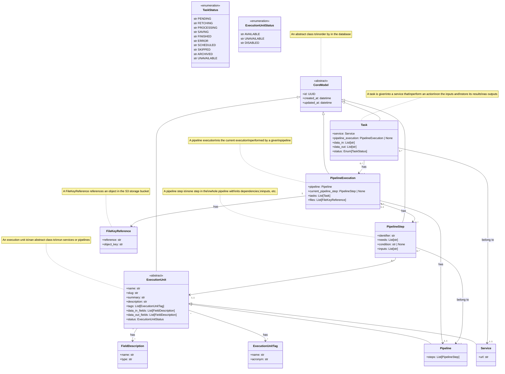

# Core engine

- [:material-account-group: Main author - HEIA-FR & HEIG-VD](https://www.hes-so.ch/swiss-ai-center/equipe)
- [:material-git: Code](https://github.com/swiss-ai-center/core-engine)
- :material-kubernetes: Deployment configuration
  ([backend](https://github.com/swiss-ai-center/core-engine/tree/main/backend/kubernetes))
  ([frontend](https://github.com/swiss-ai-center/core-engine/tree/main/frontend/kubernetes))
- :material-test-tube: Staging
  ([backend](https://backend-core-engine-swiss-ai-center.kube.isc.heia-fr.ch))
  ([frontend](https://frontend-core-engine-swiss-ai-center.kube.isc.heia-fr.ch))
- :material-factory: Production
  ([backend - not available yet](https://app.swiss-ai-center.ch/api))
  ([frontend - not available yet](https://app.swiss-ai-center.ch))

## Description

The Core engine allows to create and manage pipelines of microservices.

The Core engine is split in two main services:

- [Core engine Backend](#backend) - The API to register services and create
  pipelines
- [Core engine Frontend](#frontend) - The user interface to interact with the
  backend

Another service is available, [GlitchTip](../explanations/about-glitchtip.md),
to centralize the logging errors thrown by the Core engine and its services.

## Backend

The Core engine Backend is built using Python 3.10, FastAPI, SQLModel and
Domain-driven design.

The API documentation is automatically generated by FastAPI using the OpenAPI
standard. A user-friendly interface provided by Swagger is available under the
`/docs` route, where the endpoints of the services are described.

### Diagrams

#### UML diagram (current version)

The models defined for each class is represented as follows. This diagram
represents the current version of the Core engine. A future and ideal version is
available in the
[**UML diagram (future and ideal vision)**](#uml-diagram-future-and-ideal-vision).

```mermaid
TODO
```
#### UML diagram (future and ideal vision)

The models defined for each class is represented as follows. This diagram
represents the future vision and ideal version of the Core engine.

At the time being, the Core engine is not fully implemented as described in the
diagram, mostly due to [SQLModel](../explanations/about-sqlmodel.md) limitations
with inherence. The diagram is a vision of the Core engine and its services.



#### Sequence

A normal sequence of events when launching a request to a service is represented
as follows:


### Environment variables

All environment variables are described in the
[`.env`](https://github.com/swiss-ai-center/core-engine/blob/main/core-engine/.env)
file.

The environment variables can be overwritten during the CI/CD pipeline described
in the
[`backend.yml`](https://github.com/swiss-ai-center/core-engine/blob/main/.github/workflows/backend.yml)
GitHub workflow file.

### Run the tests with Python

!!! info

    You might need to initialize a virtual environment before running the tests.

    Check the
    [**Start the Core engine locally > Start the Core engine locally with plain Python and Node.js**](#start-the-core-engine-locally)
    to initialize and activate a virtual environment.

For each module a test file is available to check the correct behavior of the
code. The tests are run using the `pytest` library with code coverage check. To
run the tests, use the following command inside the `src` folder:

```sh
# Run the tests
pytest
```

## Frontend

The Frontend is built using React and TypeScript.

### Environment variables

All environment variables are described in the
[`.env`](https://github.com/swiss-ai-center/core-engine/blob/main/frontend/.env)
file.

The environment variables can be overwritten during the CI/CD pipeline described
in the
[`frontend.yml`](https://github.com/swiss-ai-center/core-engine/blob/main/.github/workflows/frontend.yml)
GitHub workflow file.

### Build the application

In the `frontend` directory, build the Core engine Frontend with the following
commands.

```sh
# Install the dependencies
npm ci

# Build the Core engine Frontend
npm run build
```

The output of the build is in the `build` directory.

Once a React application is built, the environment variables cannot be changed.

### Build and run the Docker image

In order to build the Docker image, the application must be
[built](#build-the-application) beforehand. Then, the Docker image can be built
with the following commands.

```sh
# Build the Docker image with a tag
docker build -t swiss-ai-center/core-engine-frontend .

# Run the Docker image
docker run -p 3000:80 swiss-ai-center/core-engine-frontend
```

The Core engine Frontend is available on <http://localhost:3000>.

> **Q**: _Why don't we build the React application within the Docker image?_
>
> **A**: This setup allows us to speed up the build process of the Docker image:
> it does not need to download and install all dependencies every time the
> `package.json` file is updated. In a CI/CD set up, the `node_modules` can be
> cached in the `build` stage and the output can be passed to the `publish`
> stage.

## Start the Core engine locally

!!! tip

    If you are not familiar with the Core engine and its services, we recommend to
    follow the [**Getting started**](../tutorials/getting-started.md) guide first.

You have several options to start the Core engine locally:

- Start the Core engine locally with Docker Compose (recommended)
- Start the Core engine locally with plain Python and Node.js
- Start the Core engine locally with minikube and official Docker images
- Start the Core engine locally with minikube and local Docker images

=== "Docker Compose (recommended)"

    In the `backend` directory, start the Core engine Backend with the following
    commands:

    ```sh
    # Build the Docker image
    docker compose build

    # Start the Core engine Backend
    docker compose up
    ```

    Access the Core engine Backend documentation at <http://localhost:8080/docs>.

    In the `frontend` directory, start the Core engine Frontend with the following
    commands:

    ```sh
    # Build the Docker image
    docker compose build

    # Start the Core engine Frontend
    docker compose up
    ```

    Access the Core engine Frontend on <http://localhost:3000>.

=== "Plain Python and Node.js"

    In the `backend` directory, start the Core engine Backend with the following
    commands:

    ```sh
    # Start the dependencies
    docker compose up minio db

    # Generate the virtual environment
    python3.10 -m venv .venv

    # Activate the virtual environment
    source .venv/bin/activate

    # Install the requirements
    pip install \
        --requirement requirements.txt \
        --requirement requirements-all.txt
    ```

    Start the application.

    ```sh
    # Optional: Edit the environment variables
    vim .env

    # Switch to the `src` directory
    cd src

    # Start the application
    uvicorn --reload --port 8080 main:app
    ```

    Access the Core engine Backend documentation at <http://localhost:8080/docs>.

    In the `frontend` directory, start the Core engine Frontend with the following
    commands:

    ```sh
    # Install the dependencies
    npm ci

    # Optional: Edit the environment variables
    vim .env

    # Start the Core engine Frontend
    npm run start
    ```

    Access the Core engine Frontend on <http://localhost:3000>.

=== "minikube and official Docker images"

    Start the Core engine Backend with the following commands. This will start the
    Core engine with the official Docker images that are hosted on GitHub.

    In the `backend` directory, start the Core engine Backend with the following
    commands:

    ```sh
    # Start MinIO
    kubectl apply \
        -f kubernetes/minio.pvc.yml \
        -f kubernetes/minio.config-map.yml \
        -f kubernetes/minio.stateful.yml \
        -f kubernetes/minio.service.yml

    # Start PostgreSQL
    kubectl apply \
        -f kubernetes/postgres.pvc.yml \
        -f kubernetes/postgres.config-map.yml \
        -f kubernetes/postgres.stateful.yml \
        -f kubernetes/postgres.service.yml

    # Start the core-engine
    kubectl apply \
        -f kubernetes/core-engine-backend.config-map.yml \
        -f kubernetes/core-engine-backend.stateful.yml \
        -f kubernetes/core-engine-backend.service.yml
    ```

    Create a tunnel to access the Kubernetes cluster from the local machine. The
    terminal in which the tunnel is created must stay open:

    ```sh
    # Open a tunnel to the Kubernetes cluster
    minikube tunnel --bind-address 127.0.0.1
    ```

    Access the Core engine Backend documentation on <http://localhost:8080/docs>.

    Start the Core engine Frontend with the following commands. This will start the
    Core engine Frontend with the official Docker images that are hosted on GitHub.

    In the `frontend` directory, start the Core engine Frontend with the following
    commands.

    ```sh
    # Start the Core engine Frontend
    kubectl apply \
        -f kubernetes/core-engine-frontend.stateful.yml \
        -f kubernetes/core-engine-frontend.service.yml
    ```

    Create a tunnel to access the Kubernetes cluster from the local machine. The
    terminal in which the tunnel is created must stay open.

    ```sh
    # Open a tunnel to the Kubernetes cluster
    minikube tunnel --bind-address 127.0.0.1
    ```

    Access the Core engine Frontend on <http://localhost:3000>.

=== "minikube and local Docker images"

    !!! warning

        The Core engine Backend StatefulSet (`core-engine.stateful.yml` file) must be
        deleted and recreated every time a new Docker image is created.

    In the `backend` directory, build the Docker image with the following commands:

    ```sh
    # Access the Minikube's Docker environment
    eval $(minikube docker-env)

    # Build the Docker image
    docker build -t ghcr.io/swiss-ai-center/core-engine:latest .

    # Exit the Minikube's Docker environment
    eval $(minikube docker-env -u)

    # Edit the `kubernetes/core-engine.stateful.yml` file to use the local image by uncommented the line `imagePullPolicy`
    #
    # From
    #
    #        # imagePullPolicy: Never
    #
    # To
    #
    #        imagePullPolicy: Never
    ```

    In the `backend` directory, start the Core engine Backend with the following
    commands:

    ```sh
    # Start MinIO
    kubectl apply \
        -f kubernetes/minio.pvc.yml \
        -f kubernetes/minio.config-map.yml \
        -f kubernetes/minio.stateful.yml \
        -f kubernetes/minio.service.yml

    # Start PostgreSQL
    kubectl apply \
        -f kubernetes/postgres.pvc.yml \
        -f kubernetes/postgres.config-map.yml \
        -f kubernetes/postgres.stateful.yml \
        -f kubernetes/postgres.service.yml

    # Start the core-engine
    kubectl apply \
        -f kubernetes/core-engine-backend.config-map.yml \
        -f kubernetes/core-engine-backend.stateful.yml \
        -f kubernetes/core-engine-backend.service.yml
    ```

    Create a tunnel to access the Kubernetes cluster from the local machine. The
    terminal in which the tunnel is created must stay open:

    ```sh
    # Open a tunnel to the Kubernetes cluster
    minikube tunnel --bind-address 127.0.0.1
    ```

    Access the Core engine Backend documentation on <http://localhost:8080/docs>.

    !!! warning

        The service StatefulSet (`frontend.stateful.yml` file) must be deleted and
        recreated every time a new Docker image is created.

    Start the service with the following commands. This will start the service with
    the a local Docker image for the service.

    In the `frontend` directory, build the Docker image with the following commands.

    ```sh
    # Install Node dependencies
    npm ci

    # Optional: Edit the environment variables to change the Core engine URL
    vim .env

    # Build the Core engine Frontend
    npm run build

    # Access the Minikube's Docker environment
    eval $(minikube docker-env)

    # Build the Docker image
    docker build -t ghcr.io/swiss-ai-center/core-engine-frontend:latest .

    # Exit the Minikube's Docker environment
    eval $(minikube docker-env -u)

    # Edit the `kubernetes/frontend.stateful.yml` file to use the local image by uncommented the line `imagePullPolicy`
    #
    # From
    #
    #        # imagePullPolicy: Never
    #
    # To
    #
    #        imagePullPolicy: Never
    ```

    In the `frontend` directory, start the service with the following commands.

    ```sh
    # Start the Core engine Frontend
    kubectl apply \
        -f kubernetes/core-engine-frontend.config-map.yml \
        -f kubernetes/core-engine-frontend.stateful.yml \
        -f kubernetes/core-engine-frontend.service.yml
    ```

    Create a tunnel to access the Kubernetes cluster from the local machine. The
    terminal in which the tunnel is created must stay open.

    ```sh
    # Open a tunnel to the Kubernetes cluster
    minikube tunnel --bind-address 127.0.0.1
    ```

    Access the Core engine Frontend on <http://localhost:3000>.
