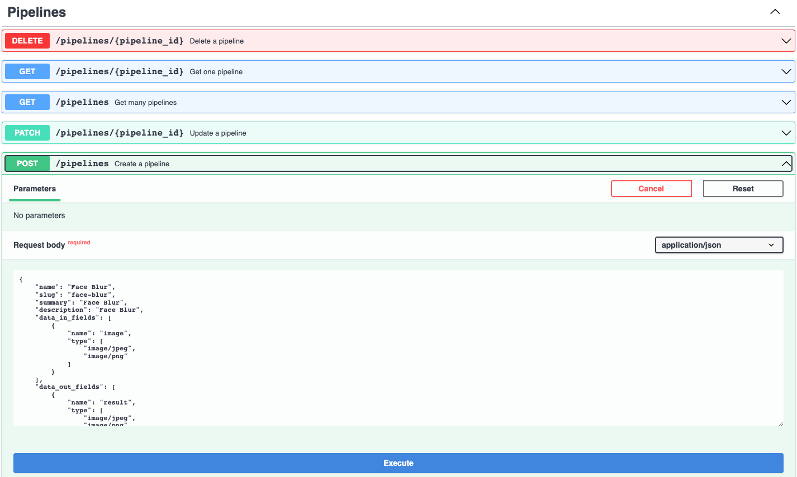
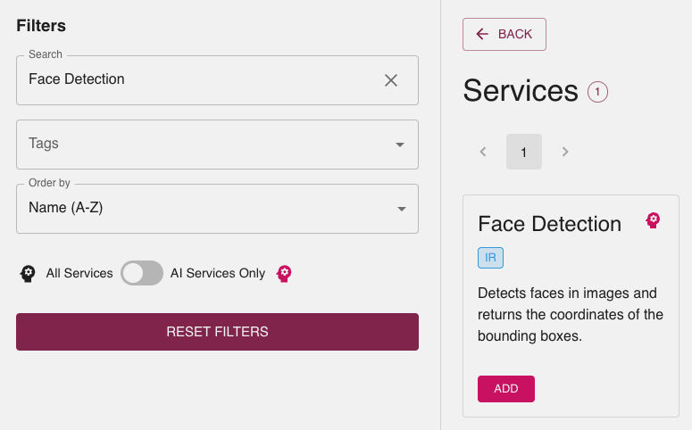

# Create a pipeline that blurs faces in an image

This tutorial shows how to implement a
[Pipeline](../reference/core-concepts/pipeline.md) in the Swiss AI Center
project step by step. It will guide you through the process of creating a
[Pipeline](../reference/core-concepts/pipeline.md) to detect faces in an image
and blur them.

## Tutorial

### Prerequisites

To follow this tutorial, you need to have the following tools installed:

- [Python 3.11](https://www.python.org/downloads/) (You can use Python 3.10 if
  you encounter issues with Python 3.11)
- An IDE (e.g. [Visual Studio Code](https://code.visualstudio.com/))

### Prepare the Core engine

To implement a [Pipeline](../reference/core-concepts/pipeline.md), you need to
have a running [Core engine](../reference/core-engine.md). If you don't have
one, you can follow the [Core engine](../reference/core-engine.md)
documentation.

### Prepare the services

The first step is to prepare the services that will be used in the
[Pipeline](../reference/core-concepts/pipeline.md). In this tutorial, we will
use the following services:

- [Face detection](https://face-detection-swiss-ai-center.kube.isc.heia-fr.ch)
- [Image blur](https://image-blur-swiss-ai-center.kube.isc.heia-fr.ch)

#### Launch the services

If the services are not running you can follow the explanations in the reference
documentation to start them.

- [Face detection](../reference/services/face-detection.md)
- [Image blur](../reference/services/image-blur.md)

### Create the pipeline

=== "By hand"


    The [Pipeline](../reference/core-concepts/pipeline.md) is created by posting a
    JSON object to the `/pipelines` endpoint of the
    [Core engine](../reference/core-engine.md). Create a file named
    `face-blur-pipeline.json` in your IDE with the following code:

    ```json hl_lines="29 36"
    {
        "name": "Face Blur",
        "slug": "face-blur",
        "summary": "Blur the faces in an image",
        "description": "Use Face Detection service to locate the faces in the image and send the bounding boxes to the Image Blur service to get the final result",
        "data_in_fields": [
            {
                "name": "image",
                "type": [
                    "image/jpeg",
                    "image/png"
                ]
            }
        ],
        "data_out_fields": [
            {
                "name": "result",
                "type": [
                    "image/jpeg",
                    "image/png"
                ]
            }
        ],
        "tags": [
            {
                "name": "Image Recognition",
                "acronym": "IR"
            },
            {
                "name": "Image Processing",
                "acronym": "IP"
            }
        ],
        "steps": [
            {
                "identifier": "face-detection",
                "needs": [],
                "inputs": ["pipeline.image"],
                "service_slug": "face-detection" // Change this to your face detection service slug
            },
            {
                "identifier": "image-blur",
                "needs": ["face-detection"],
                "condition": "len(face-detection.result['areas']) > 0",
                "inputs": ["pipeline.image", "face-detection.result"],
                "service_slug": "image-blur" // Change this to your image blur service slug
            }
        ]
    }
    ```
    
    !!! note
        You can find the slug of your services by going to the FastAPI documentation of
        the running [Core engine](../reference/core-engine.md) and use the `/services`
        endpoint. You will find the slug of your services in the response.
    
        ```json hl_lines="6 11"
            [
                {
                    "created_at": "2023-06-01T13:55:15.936033",
                    "updated_at": "2023-06-01T13:55:19.831817",
                    "name": "Face Detection",
                    "slug": "face-detection",
                }, {
                    "created_at": "2023-06-01T13:55:15.936033",
                    "updated_at": "2023-06-01T13:55:19.800560",
                    "name": "Image Blur",
                    "slug": "image-blur",
                }
            ]
        ```
    
    What we just did is to create a
    [Pipeline](../reference/core-concepts/pipeline.md) with two steps. The first
    step is the face detection service and the second step is the image blur
    service. The second step will only be executed if the first step detects at
    least one face. The [Pipeline](../reference/core-concepts/pipeline.md) will take
    an image as input and return an image as output.
    
    The inputs of each step are the outputs of the previous steps. The first step
    takes the pipeline's image as input and the second step takes the
    [Pipeline](../reference/core-concepts/pipeline.md)'s image and the result of the
    face detection as input.
    
    !!! note
        The `identifier` field of each step is the name of the step in the
        [Pipeline](../reference/core-concepts/pipeline.md). It is used to reference the
        step in the `needs` and `inputs` fields.
    
    ### Post the pipeline
    
    Now that we have our [Pipeline](../reference/core-concepts/pipeline.md), we can
    post it to the [Core engine](../reference/core-engine.md). To do so, go to the
    FastAPI documentation of the running [Core engine](../reference/core-engine.md)
    and use the `/pipelines` endpoint to post the
    [Pipeline](../reference/core-concepts/pipeline.md) by clicking on the
    `Try it out` button
    
    Simply copy the content of the `face-blur-pipeline.json` file and paste it in
    the `body` field of the `/pipelines` endpoint and click on the `Execute` button.
    
    
    
    You should receive a `200` response with the
    [Pipeline](../reference/core-concepts/pipeline.md) you just posted.

=== "Using the Core engine interface"

    Go to the Webapp on your browser to the  "/createPipeline" page of the [Core engine](../reference/core-engine.md).
    From here you can chose from all available services to add to the new pipeline. First select the Face detection 
    service. You can use the use the searchbar and filters on the side to help you find it.

    
    
    Click the "Add" button of the service. This will a dd a new new node in the flow chart. 

    

    Do the same with the Image Blur service. You should now have 4 nodes in the flow chart. You can click on the nodes to drag and 
    move them around to rearrange their disposition.
    

    There are 3 types of nodes:

    - Entry node. It defines the input files the pipeline needs, and their types. Each input file has a handle you can connect 
    to a service to pass on the data as input for the service.

    - Exit node. It is the last node of the pipeline. Only one service (one handle) can be connected to it. The service connected to it 
    defines what the output of the pipeline as whole will be.

    - Service node. Each one represents a distinct service. For each data input the service needs, there is a handle you can connect to a data source, either the output of another service or
    the input files of the pipeline defined by the entry node.
    

    Click the "Add input file" button on entry node, select a name for your input, and select the types image/jpeg and image/png.
    
    The new input can now be connected to the services. Each takes an image, in this case it will be the same image. Click on the handle 
    next to the input on the entry Node and drag your mouse to the handle next to the service's input called "image". Do so for both services.


    
    
    There are two steps to the pipeline. The first one detects faces in a given image and the second blurs them. The output of the 
    first service can be given to the second for the blurring process. To do so link the output of Face detection to the input of 
    Image Blur as you did with the entry node inputs.

    The second step should only be executed if at least one face was detected by the first service. Conditions can added on input files
    by clicking the circled plus icon on the edge.
    Click on the edge connecting the output of the Face detection to the Image Blur and input the following

    ```python
    len(face-detection.result['areas']) > 0
    ```
    Conditions are python expressions that will be evaluated to determine if the service should be executed.
    You can remove a condition by clicking the "x" button next to it.

    The second service can now be connected to the Exit node, completing the pipeline. Your pipeline should look something like this.

    

    As a last step, the pipeline information must be completed. Input the following in the corresponding text fields.

    ```
    Pipeline name: Face Blur
    Pipeline-slug: face-blur
    summary: Blur the faces in an image
    Pipeline description: Use Face Detection service to locate the faces in the image and send the bounding boxes to the Image Blur service to get the final result
    ```


    Before creating the pipeline, make sure sure it's valid by clicking the "Check Validitiy" button under the pipeline information.
    An information box should be appear to inform you on the validity of the pipeline. Once the pipeline is valid, you can
    create it by clicking "Create pipeline"

### Run the pipeline

You can run the pipeline using the FastAPI Swagger interface or by using the
[Core engine](../reference/core-engine.md).

#### Using the FastAPI Swagger interface

Now that we have our [Pipeline](../reference/core-concepts/pipeline.md), we can
run it. To do so, go to the FastAPI documentation of the running
[Core engine](../reference/core-engine.md) and you should see the
[Pipeline](../reference/core-concepts/pipeline.md) you just posted in the
`Registered pipelines` endpoint with the slug `/face-blur`.


Click on the `Try it out` button, add an image to the body and click on the
`Execute` button.


You should receive a `200` response with a `Pipeline Execution` object in the
response body. This object contains the id of the execution and the tasks that
will be executed.

```json hl_lines="5-23"
{
  "pipeline_id": "2175ae79-4e48-4d1b-97df-0bcbba4c5d2b",
  "current_pipeline_step_id": "e0028cf9-0b62-48b4-b0c7-b91ec930d083",
  // ...
  "tasks": [
    {
      "data_in": [
        "e930424b-63a8-4a4e-b49c-54eb50cd1996.jpg"
      ],
      "data_out": null,
      "status": "pending",
      "service_id": "35ace881-6673-4fb6-b454-2f94b1547fd6",
      "pipeline_execution_id": "a17dd3ef-0682-4154-baaa-cb524650f6f4",
      "id": "01636a67-b78e-41a6-9127-9efa1f0c1a9a"
    }, {
      "data_in": null,
      "data_out": null,
      "status": "scheduled",
      "service_id": "6a20b1b7-ef3d-4a01-bf05-409558bda916",
      "pipeline_execution _id": "a17dd3ef-0682-4154-baaa-cb524650f6f4",
      "id": "9557c201-477f-45c6-8b8a-93ce93079f74"
    }
  ]
}
```

You can check the status of the execution by checking the status of the last
task with the `/tasks/{task_id}` endpoint. You can find the id of the last task
in the `tasks` array of the [Pipeline](../reference/core-concepts/pipeline.md)
execution object.

```json hl_lines="9 14"
 {
  "created_at": "2023-06-06T14:45:25.517644",
  "updated_at": "2023-06-13T11:50:10.151580",
  "data_in": [
    "e930424b-63a8-4a4e-b49c-54eb50cd1996.jpg",
    "2594162e-7927-4dc9-9a22-d135154f9e93.json"
  ],
  "data_out": [
    "bfc86360-ad3f-4249-aaa1-21d36e84f612.jpg"
  ],
  "status": "finished",
  "service_id": "6a20b1b7-ef3d-4a01-bf05-409558bda916",
  "pipeline_execution_id": "a17dd3ef-0682-4154-baaa-cb524650f6f4",
  "id": "9557c201-477f-45c6-8b8a-93ce93079f74",
  // ...
  "pipeline_execution": {
    "created_at": "2023-06-06T14:45:25.517644",
    "updated_at": "2023-06-13T11:50:10.156728",
    "pipeline_id": "2175ae79-4e48-4d1b-97df-0bcbba4c5d2b",
    "current_pipeline_step_id": null,
    "id": "a17dd3ef-0682-4154-baaa-cb524650f6f4",
    "files": null
  }
}
```

Once the status of the last task is `finished`, you can download the result by
copying the data_out file keys and use them with the `/storage/{key}` endpoint.


If the picture you provided had a face, the result should be blurred.

#### Using the Webapp

You can also run the [Pipeline](../reference/core-concepts/pipeline.md) using
the [Core engine](../reference/core-engine.md). To do so, go to the Webapp in
your browser and find the [Pipeline](../reference/core-concepts/pipeline.md) you
just posted in the `Pipelines` section.


Click on the `VIEW` button and you should see the
[Pipeline](../reference/core-concepts/pipeline.md) as a Flow.


Click on the `UPLOAD` button and upload an image. Now you can click on the `RUN`
button and the [Pipeline](../reference/core-concepts/pipeline.md) will be
executed. When the [Pipeline](../reference/core-concepts/pipeline.md) is
finished, you can download the result by clicking on the `DOWNLOAD` button that
will be enabled.


If the picture you provided had a face, the result should be blurred.

!!! success "Congratulations!"
    You have successfully created a
    [Pipeline](../reference/core-concepts/pipeline.md) locally. Now, you can use the
    same process to create a [Pipeline](../reference/core-concepts/pipeline.md) on
    the [Core engine](../reference/core-engine.md) deployed on the cloud.
