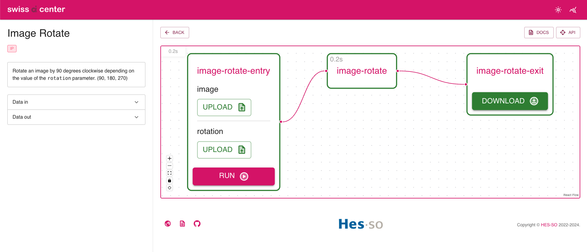

# Create a service to rotate an image (generic template)

This tutorial shows how to implement a
[Service](../reference/core-concepts/service.md) in the Swiss AI Center project
step by step. The [Service](../reference/core-concepts/service.md) is a simple
image rotation tool that rotates the image by 90, 180, 270 degrees clockwise
depending on the value of the `rotation` parameter.

## Introduction

This tutorial shows how to implement a
[Service](../reference/core-concepts/service.md) that rotates the image by 90,
180, 270 degrees clockwise depending on the value of the `rotation` parameter.

## Prerequisites

To follow this tutorial, we highly recommend you to follow the
[Getting started](../tutorials/getting-started.md) guide first.

It contains all the required tools to follow this tutorial.

## Bootstrap the service based on the generic template

In this section, you will bootstrap a new service based on the
[_Create a new service (generic) template_](https://github.com/swiss-ai-center/create-a-new-service-generic-template).

You have three ways to bootstrap a new service based on the template:

=== "Use the template"

    If you are part of the Swiss AI Center GitHub organization, this is the
    recommended way to bootstrap a new service.

    Access the
    [_Create a new service (generic) template_](https://github.com/swiss-ai-center/create-a-new-service-generic-template).

    Use the **"Use the template"** button to create a new repository based on the
    template in the Swiss AI Center GitHub organization or in your own GitHub
    account.

    For the **Repository name**, use `my-image-rotate-service`.

    Clone the newly created repository locally.

    This will be the root directory of your new service for the rest of this
    tutorial.

=== "Fork the template"

    If you are not part of the Swiss AI Center GitHub organization, this is the
    recommended way to bootstrap a new service.

    Fork the
    [_Create a new service (generic) template_](https://github.com/swiss-ai-center/create-a-new-service-generic-template).
    to fork a new repository based on the chosen template.

    For the **Repository name**, use `my-image-rotate-service`.

    Clone the newly created repository locally.

    This will be the root directory of your new service for the rest of this
    tutorial.

=== "Download the template"

    If you do not want to host your codebase on GitHub or if you do not want to be
    linked to the Swiss AI Center organization, download the
    [_Create a new service (generic) template_](https://github.com/swiss-ai-center/create-a-new-service-generic-template).
    as an archive file (**"Download ZIP"**) from the GitHub repository and start
    over locally or in a new Git repository.

    Extract the archive and name the directory `my-image-rotate-service`.

    This will be the root directory of your new service for the rest of this
    tutorial.

## Explaining the template

In this section, you will learn about the different files and folders that are
part of the template.

### `README.md`

This file contains a checklist of the steps to follow to bootstrap a new service
based on the template. This can help you to follow step-by-step what you need to
do to bootstrap a new service based on the template.

### Other files and folders

The other files and folders contain everything to serve your tool. This is where
you will implement to do it over a [FastAPI](../explanations/about-fastapi.md)
REST API.

## Implement the service

### Create a virtual environment

Instead of installing the dependencies globally, it is recommended to create a
virtual environment.

To create a virtual environment, run the following command inside the project
folder:

```sh title="Execute this in the 'root' folder"
# Create a virtual environment
python3.10 -m venv .venv
```

Then, activate the virtual environment:

```sh title="Execute this in the 'root' folder"
# Activate the virtual environment
source .venv/bin/activate
```

### Install the dependencies

!!! warning
    Make sure you are in the virtual environment.

Update the `requirements.txt` file with the following content:

```txt hl_lines="2 3"
common-code[test] @ git+https://github.com/swiss-ai-center/common-code.git@main
numpy==1.24.1
opencv-python==4.7.0.72
```

The `common-code` package is required to serve the model over a FastAPI REST API
and boilerplate code to handle the configuration.

We will also need to install numpy and opencv-python for the service to work.

Install the dependencies as explained in the previous section:

```sh title="Execute this in the virtual environment"
# Install the dependencies
pip install --requirement requirements.txt
```

Create a freeze file to pin all dependencies to their current versions:

```sh title="Execute this in the virtual environment"
# Freeze the dependencies
pip freeze --local --all > requirements-all.txt
```

This will ensure that the same versions of the dependencies are installed on
every machine if you ever share your code with someone else.

### Update the template files

#### Update the README

Open the `README.md` file and update the title and the description of the
[Service](../reference/core-concepts/service.md).

```md
# Image Rotate

This service rotates an image by 90, 180 or 270 degrees clockwise.
```

!!! note

    If the service is part of the Swiss AI Center GitHub organization also add a
    link to the [Service](../reference/core-concepts/service.md)'s
    [Reference](../reference/core-concepts/service.md) page in the repository
    README.md file.

    ```md
    # Image Rotate

    This service rotates an image by 90, 180 or 270 degrees clockwise.

    _Check the [related documentation](https://swiss-ai-center.github.io/swiss-ai-center/reference/image-rotate) for more information._
    ```

#### Update the `pyproject.toml` file

```toml title="pyproject.toml" hl_lines="2"
[project]
name = "image-rotate"

[tool.pytest.ini_options]
pythonpath = [".", "src"]
addopts = "--cov-config=.coveragerc --cov-report xml --cov-report term-missing --cov=./src"
```

1. Change the name of the project to `image-rotate`.

#### Update the `src/main.py` file

All the code of the [Service](../reference/core-concepts/service.md) is in the
`main.py` file. The [Service](../reference/core-concepts/service.md) is a simple
image rotation service that rotates the image by 90, 180, 270 degrees clockwise
depending on the value of the `rotation` parameter.

Open the `main.py` with your favorite editor and follow the instructions below.

```py hl_lines="23-25 32-34 43-44 50-64 68-96 100-106 109-119"
import asyncio
import time
from fastapi import FastAPI
from fastapi.middleware.cors import CORSMiddleware
from fastapi.responses import RedirectResponse
from common_code.config import get_settings
from common_code.http_client import HttpClient
from common_code.logger.logger import get_logger, Logger
from common_code.service.controller import router as service_router
from common_code.service.service import ServiceService
from common_code.storage.service import StorageService
from common_code.tasks.controller import router as tasks_router
from common_code.tasks.service import TasksService
from common_code.tasks.models import TaskData
from common_code.service.models import Service
from common_code.service.enums import ServiceStatus
from common_code.common.enums import FieldDescriptionType, ExecutionUnitTagName, ExecutionUnitTagAcronym
from common_code.common.models import FieldDescription, ExecutionUnitTag
from contextlib import asynccontextmanager

# Imports required by the service's model
# TODO: 1. ADD REQUIRED IMPORTS (ALSO IN THE REQUIREMENTS.TXT) (1)!
import cv2
import numpy as np
from common_code.tasks.service import get_extension

settings = get_settings()


class MyService(Service):
    # TODO: 2. CHANGE THIS DESCRIPTION (2)!
    """
    Image rotate model
    """

    # Any additional fields must be excluded of model by adding a leading underscore for Pydantic to work
    model: object
    logger: Logger

    def __init__(self):
        super().__init__(
            # TODO: 3. CHANGE THE SERVICE NAME AND SLUG (3)!
            name="Image Rotate",
            slug="image-rotate",
            url=settings.service_url,
            summary=api_summary,
            description=api_description,
            status=ServiceStatus.AVAILABLE,
            # TODO: 4. CHANGE THE INPUT AND OUTPUT FIELDS, THE TAGS AND THE HAS_AI VARIABLE (4)!
            data_in_fields=[
                FieldDescription(name="image", type=[FieldDescriptionType.IMAGE_PNG, FieldDescriptionType.IMAGE_JPEG]),
                FieldDescription(name="rotation", type=[FieldDescriptionType.TEXT_PLAIN]),
            ],
            data_out_fields=[
                FieldDescription(name="result", type=[FieldDescriptionType.IMAGE_PNG, FieldDescriptionType.IMAGE_JPEG]),
            ],
            tags=[
                ExecutionUnitTag(
                    name=ExecutionUnitTagName.IMAGE_PROCESSING,
                    acronym=ExecutionUnitTagAcronym.IMAGE_PROCESSING
                ),
            ],
            has_ai=False,
            docs_url="https://docs.swiss-ai-center.ch/reference/core-concepts/service/", # (5)!
        )
        self._logger = get_logger(settings)

    # TODO: 5. CHANGE THE PROCESS METHOD (CORE OF THE SERVICE) (6)!
    def process(self, data):
        # NOTE that the data is a dictionary with the keys being the field names set in the data_in_fields
        raw = data["image"].data
        input_type = data["image"].type
        rotation = data["rotation"].data

        if len(rotation) == 0:
            rotation = 90
        else:
            rotation = int(rotation)

        # Decode the image
        img = cv2.imdecode(np.frombuffer(raw, np.uint8), 1)

        # Rotate the image
        for i in range(int(rotation / 90)):
            img = cv2.rotate(img, cv2.ROTATE_90_CLOCKWISE)
        # Encode the image with the same format as the input
        guessed_extension = get_extension(input_type)
        is_success, out_buff = cv2.imencode(guessed_extension, img)

        # NOTE that the result must be a dictionary with the keys being the field names set in the data_out_fields
        return {
            "result": TaskData(
                data=out_buff.tobytes(),
                type=input_type,
            )
        }

...

# TODO: 6. CHANGE THE API DESCRIPTION AND SUMMARY (7)!
api_description = """
Rotate an image by 90 degrees clockwise depending on the value of the `rotation` parameter. (90, 180, 270)
"""
api_summary = """
Rotate an image by 90 degrees clockwise.
"""

# Define the FastAPI application with information
# TODO: 7. CHANGE THE API TITLE, VERSION, CONTACT AND LICENSE (8)!
app = FastAPI(
    lifespan=lifespan,
    title="Image Rotate API.",
    description=api_description,
    version="1.0.0",
    contact={
        "name": "Swiss AI Center",
        "url": "https://swiss-ai-center.ch/",
        "email": "info@swiss-ai-center.ch",
    },
    swagger_ui_parameters={
        "tagsSorter": "alpha",
        "operationsSorter": "method",
    },
    license_info={
        "name": "GNU Affero General Public License v3.0 (GNU AGPLv3)",
        "url": "https://choosealicense.com/licenses/agpl-3.0/",
    },
)
...
```

1. Import the OpenCV library and the get_extension function from the tasks
   service. This function is used to guess the extension of the image based on the
   input type.
2. Change the description of the service.
3. Change the name and the slug of the service. This is used to identify the
   service in the Core engine.
4. Change the input/output fields of the service. The name of the field is the
   key of the dictionary that will be used in the process function. The type of the
   field is the type of the data that will be sent to the service. They are defined
   in the FieldDescriptionType enum. The tags are used to identify the service in
   the Core engine. The `has_ai` variable is used to identify if the service is an
   AI service.
5. Optional: Edit the documentation URL of the service.
6. Change the process function. This is the core of the service. The data is a
   dictionary with the keys being the field names set in the data_in_fields. The
   result must be a dictionary with the keys being the field names set in the
   data_out_fields.
7. Change the API description and summary. The description is a markdown string
   that will be displayed in the API documentation. The summary is a short
   description of the API.
8. Change the API title, version, contact and license.

!!! Note
    The `process` function TaskData object must be serializable.

!!! Note
    The input and output data of the process function are bytes. Depending on the
    wanted type of the data, you might need to convert the data to the expected
    type.

#### Update the `Dockerfile` file

Update the Dockerfile to install all required packages that might be required by
the model and the model itself:

```dockerfile hl_lines="5"
# Base image
FROM python:3.10

# Install all required packages to run the model
RUN apt update && apt install --yes ffmpeg libsm6 libxext6
...
```

1. Add any additional packages required to run your model.

### Start the service

!!! tip

    Start the Core engine as mentioned in the
    [Getting started](../tutorials/getting-started.md) guide for this step.

Start the service with the following command:

```sh title="Execute this in the virtual environment"
# Switch to the `src` directory
cd src

# Start the application
uvicorn --reload --port 9090 main:app
```

The service should try to announce itself to the Core engine.

It will then be available at <http://localhost:9090>.

Access the Core engine either at <http://localhost:3000> (Frontend UI) or
<http://localhost:9090> (Backend UI).

The service should be listed in the **Services** section.

### Test the service

!!! tip

    Start the Core engine as mentioned in the
    [Getting started](../tutorials/getting-started.md) guide for this step.

Create a file called rotation.txt and add the following content:

```txt
90
```

There are two ways to test the service:

=== "Using the Frontend UI (recommended)"

    Access the Core engine at <http://localhost:3000>.

    

    Now you can test the [Service](../reference/core-concepts/service.md) by
    clicking the `View` button. Now upload an image and the rotation file and click
    on the `Run` button.

    

    The execution should start and as soon as it is finished, the `Download` button
    should be clickable. Use it to download the result.

    

    The image should be rotated by 90 degrees.

=== "Using the Backend UI"

    Access the Core engine at <http://localhost:9090>.

    The service should be listed in the **Registered Services** section.

    **Start a new task**

    Try to start a new task with the service.

    Unfold the `/image-rotate` endpoint and click on the Try it out button. Upload
    the image and the rotation file and click on the Execute button. The response
    body should be something similar to the following:

    ```json hl_lines="4-8 12"
    {
      "created_at": "2024-01-05T14:34:48.520282",
      "updated_at": "2024-01-05T14:38:48.979189",
      "data_in": [
        "ace30502-7274-496e-b332-74e0e4c41e68.jpg",// (1)!
        "316044be-015b-4640-bf92-fd15c6cd2296.txt"
      ],
      "data_out": null,// (2)!
      "status": "pending",
      "service_id": "943f8f35-e688-4431-a426-90addbaa56c0",
      "pipeline_execution_id": null,
      "id": "056c3d3a-fc34-47b9-aa64-e233e1adc490",// (3)!
      "service": {
        "created_at": "2024-01-05T14:34:48.520282",
        "updated_at": "2024-01-05T14:36:21.279182",
        "description": "\nRotate an image by 90 degrees clockwise depending on the value of the `rotation` parameter. (90, 180, 270)\n",
        "status": "available",
        "data_in_fields": [
          {
            "name": "image",
            "type": [
              "image/png",
              "image/jpeg"
            ]
          },
          {
            "name": "rotation",
            "type": [
              "text/plain"
            ]
          }
        ],
        "data_out_fields": [
          {
            "name": "result",
            "type": [
              "image/png",
              "image/jpeg"
            ]
          }
        ],
        "tags": [
          {
            "name": "Image Processing",
            "acronym": "IP"
          }
        ],
        "has_ai": false,
        "id": "943f8f35-e688-4431-a426-90addbaa56c0",
        "name": "Image Rotate",
        "slug": "image-rotate",
        "summary": "\nRotate an image by 90 degrees clockwise.\n",
        "url": "http://localhost:9090",
        "docs_url": "https://docs.swiss-ai-center.ch/reference/services/image-rotate/",
      },
      "pipeline_execution": null
    }
    ```

    1. The input data is stored in the `data_in` field.
    2. The output is not available yet and will be stored in the `data_out` field.
    3. The task ID is stored in the `id` field.

    **Get the task status and result**

    You can then use the task ID to get the task status and the task result from the
    **Tasks** section.

    1. Click on Try it out and paste the id in the task_id field.
    2. Click on Execute.
    3. In the body response, if the status is `finished` find the `data_out` field
       and copy the id of the image
      (e.g. `a38ef233-ac01-431d-adc8-cb6269cdeb71.png`).
    4. Now, unfold the GET `/storage/{key}` endpoint under the Storage name.
    5. Click on Try it out and paste the id of the image in the key field.
    6. Click on Execute.
    7. Click on the Download file button and save the image in your computer.

    The image should be rotated by 90 degrees.
You have validated that the service works as expected.

## Commit and push the changes (optional)

Commit and push the changes to the Git repository so it is available for the
other developers.

## Build, publish and deploy the service

Now that you have implemented the service, you can build, publish and deploy it.

Follow the
[How to build, publish and deploy a service](../how-to-guides/how-to-build-publish-and-deploy-a-service.md)
guide to build, publish and deploy the service to Kubernetes.

## Access and test the service

Access the service using its URL (either by the URL defined in the
`DEV_SERVICE_URL`/ `PROD_SERVICE_URL` variable or by the URL defined in the
Kubernetes Ingress file).

You should be able to access the FastAPI Swagger UI.

The service should be available in the **Services** section of the Core engine
it has announced itself to.

You should be able to send a request to the service and get a response.

## Conclusion

Congratulations! You have successfully created a service to rotate an image.

The service has then been published to a container registry and deployed on
Kubernetes.

The service is now accessible through a REST API on the Internet and you have
completed this tutorial! Well done!
