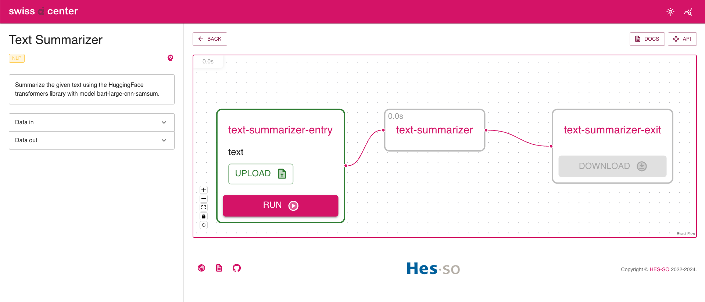
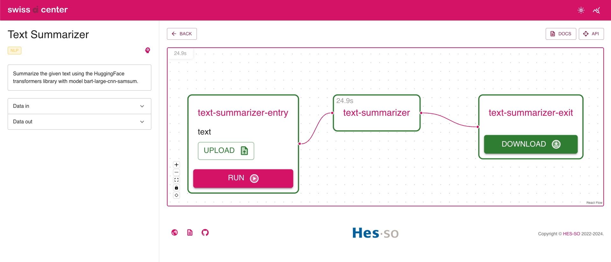

# Create a service to summarize a text using an existing model (generic template)

This tutorial shows how to implement a
[Service](../reference/core-concepts/service.md) in the Swiss AI Center project
step by step. The [Service](../reference/core-concepts/service.md) is a text
summarizer tool that summarizes a text using the
[Hugging Face](https://huggingface.co/) library.

!!! Info
    Note that a [Service](../reference/core-concepts/service.md) can be implemented
    in any programming language as long as it follows the
    [specifications](../reference/core-concepts/service.md/#specifications) of the
    Swiss AI Center project. This tutorial is using Python 3.10.

## Tutorial

### Prerequisites

To follow this tutorial, you need to have the following tools installed:

- [Python 3.10](https://www.python.org/downloads/)
- An IDE (e.g. [Visual Studio Code](https://code.visualstudio.com/))

### Prepare the development environment

#### Launch the Core engine

To be able to test the [Service](../reference/core-concepts/service.md) locally
when it is ready, you need to have a running
[Core engine](../reference/core-engine.md). To do so, follow the instructions in
the
[Core engine](../reference/core-engine.md#start-the-service-locally-with-minikube-and-the-docker-image-hosted-on-github)
reference.

#### Get the source code

!!! Info
    In this tutorial, we will implement a
    [Service](../reference/core-concepts/service.md) that uses an existing model so
    we will use the `create-a-new-service-generic-template` template.

First, you can create a repo from the
[template](https://github.com/swiss-ai-center/create-a-new-service-generic-template)
by clicking on the `Use this template` button. You can also fork it or download
it.

Once the repo is created, you can clone it on your computer. (If you downloaded
it, you can skip this step.)

```bash
git clone
```

Open your terminal and go to the folder where the source code is located.

```bash
cd path/to/the/source/code
```

#### Create a virtual environment

Instead of installing the dependencies globally, it is recommended to create a
virtual environment.

To create a virtual environment, run the following command inside the project
folder:

```sh
python3.10 -m venv .venv
```

Then, activate the virtual environment:

```sh
source .venv/bin/activate
```

#### Install the dependencies

For the [Service](../reference/core-concepts/service.md) to work we will need to
install transformers and torch in addition to the dependencies of the template.
So edit the `requirements.txt` file and add the following lines:

```txt hl_lines="2 3"
common-code[test] @ git+https://github.com/swiss-ai-center/common-code.git@main
transformers==4.36.2
torch==2.1.2
```

Then, install the dependencies:

```sh
pip install --requirement requirements.txt
```

Create a freeze file to list the dependencies with their versions.

```sh
pip freeze --local --all > requirements-all.txt
```

This will install the default [Service](../reference/core-concepts/service.md)
dependencies and the ones we just added. The freeze file will be used to ensure
all the developers have the same dependencies.

#### Implement the service

##### Update the README

Open the `README.md` file and update the title and the description of the
[Service](../reference/core-concepts/service.md).

```md
# Text Summarizer

This service summarizes a text using the Hugging Face library.
```

!!! note

    If the service is part of the Swiss AI Center GitHub organization also add a
    link to the [Service](../reference/core-concepts/service.md)'s
    [Reference](../reference/core-concepts/service.md) page in the repository
    README.md file.

    ```md
    # Text Summarizer

    This service summarizes a text using the Hugging Face library.

    _Check the [related documentation](https://swiss-ai-center.github.io/swiss-ai-center/reference/text-summarizer) for more information._
    ```

##### Update the service pyproject title

```toml hl_lines="3"
[project]
# TODO: 1. CHANGE THE NAME OF THE PROJECT (1)!
name = "text-summarizer"

[tool.pytest.ini_options]
pythonpath = [".", "src"]
addopts = "--cov-config=.coveragerc --cov-report xml --cov-report term-missing --cov=./src"
```

1. Change the name of the project to `text-summarizer`.

##### Update the service code

All the code of the [Service](../reference/core-concepts/service.md) is in the
`main.py` file. The [Service](../reference/core-concepts/service.md) is a text
summarizer tool that summarizes a text using the
[Hugging Face](https://huggingface.co/) library.

Open the `main.py` with your favorite editor and follow the instructions below.

```py hl_lines="23 30-32 41-42 48-60 65-85 89-96 99-109"
import asyncio
import time
from fastapi import FastAPI
from fastapi.middleware.cors import CORSMiddleware
from fastapi.responses import RedirectResponse
from common_code.config import get_settings
from common_code.http_client import HttpClient
from common_code.logger.logger import get_logger, Logger
from common_code.service.controller import router as service_router
from common_code.service.service import ServiceService
from common_code.storage.service import StorageService
from common_code.tasks.controller import router as tasks_router
from common_code.tasks.service import TasksService
from common_code.tasks.models import TaskData
from common_code.service.models import Service
from common_code.service.enums import ServiceStatus
from common_code.common.enums import FieldDescriptionType, ExecutionUnitTagName, ExecutionUnitTagAcronym
from common_code.common.models import FieldDescription, ExecutionUnitTag
from contextlib import asynccontextmanager

# Imports required by the service's model
# TODO: 1. ADD REQUIRED IMPORTS (ALSO IN THE REQUIREMENTS.TXT) (1)!
from transformers import pipeline

settings = get_settings()


class MyService(Service):
    # TODO: 2. CHANGE THIS DESCRIPTION (2)!
    """
    Text summarizer model
    """

    # Any additional fields must be excluded of model by adding a leading underscore for Pydantic to work
    _model: object
    _logger: Logger

    def __init__(self):
        super().__init__(
            # TODO: 3. CHANGE THE SERVICE NAME AND SLUG (3)!
            name="Text Summarizer",
            slug="text-summarizer",
            url=settings.service_url,
            summary=api_summary,
            description=api_description,
            status=ServiceStatus.AVAILABLE,
            # TODO: 4. CHANGE THE INPUT AND OUTPUT FIELDS, THE TAGS AND THE HAS_AI VARIABLE (4)!
            data_in_fields=[
                FieldDescription(name="text", type=[FieldDescriptionType.TEXT_PLAIN]),
            ],
            data_out_fields=[
                FieldDescription(name="result", type=[FieldDescriptionType.TEXT_PLAIN]),
            ],
            tags=[
                ExecutionUnitTag(
                    name=ExecutionUnitTagName.NATURAL_LANGUAGE_PROCESSING,
                    acronym=ExecutionUnitTagAcronym.NATURAL_LANGUAGE_PROCESSING,
                ),
            ],
            has_ai=True,
        )
        self._logger = get_logger(settings)

    # TODO: 5. CHANGE THE PROCESS METHOD (CORE OF THE SERVICE) (5)!
    def process(self, data):
                # Get the text to analyze from storage
        text = data["text"].data
        # Convert bytes to string
        text = text.decode("utf-8")

        # Limit the text to 142 words
        text = " ".join(text.split()[:500])

        # Run the model
        result = classifier(text, max_length=100, min_length=5, do_sample=False)

        # Convert the result to bytes
        file_bytes = result[0]["summary_text"].encode("utf-8")

        return {
            "result": TaskData(
                data=file_bytes,
                type=FieldDescriptionType.TEXT_PLAIN
            )
        }

...

# TODO: 6. CHANGE THE API DESCRIPTION AND SUMMARY (6)!
api_summary = """
Summarize the given text.
"""

api_description = """
Summarize the given text using the HuggingFace transformers library with model bart-large-cnn-samsum.
"""

# Define the FastAPI application with information
# TODO: 7. CHANGE THE API TITLE, VERSION, CONTACT AND LICENSE (7)!
app = FastAPI(
    lifespan=lifespan,
    title="Text summarizer API.",
    description=api_description,
    version="0.0.1",
    contact={
        "name": "Swiss AI Center",
        "url": "https://swiss-ai-center.ch/",
        "email": "info@swiss-ai-center.ch",
    },
    swagger_ui_parameters={
        "tagsSorter": "alpha",
        "operationsSorter": "method",
    },
    license_info={
        "name": "GNU Affero General Public License v3.0 (GNU AGPLv3)",
        "url": "https://choosealicense.com/licenses/agpl-3.0/",
    },
)
...
```

1. Import the required packages.
2. Change the description of the service.
3. Change the name and the slug of the service. This is used to identify the
   service in the Core engine.
4. Change the input/output fields of the service. The name of the field is the
   key of the dictionary that will be used in the process function. The type of the
   field is the type of the data that will be sent to the service. They are defined
   in the FieldDescriptionType enum. The tags are used to identify the service in
   the Core engine. The `has_ai` variable is used to identify if the service is an
   AI service.
5. Change the process function. This is the core of the service. The data is a
   dictionary with the keys being the field names set in the data_in_fields. The
   result must be a dictionary with the keys being the field names set in the
   data_out_fields.
6. Change the API description and summary.
7. Change the API title, version, contact and license.

!!! Note
    The `process` function TaskData object must be serializable.

#### Test the service

Now that the service is ready, we can test it.

##### Test the service using the test scripts

Open a terminal, navigate to the `src` folder and run the following command:

```bash
pytest --cov-report term:skip-covered --cov-report term-missing --cov=. -s --cov-config=.coveragerc
```

All the tests should pass.

```bash
======================== test session starts =========================
--------- coverage: platform darwin, python 3.10.10-final-0 ----------
Name                        Stmts   Miss  Cover   Missing
---------------------------------------------------------
src/main.py                    70     11    84%   53-70
src/tests/test_storage_service.py      83     12    86%   13-18, 24-30, 114-115
---------------------------------------------------------
TOTAL                         188     23    88%

4 files skipped due to complete coverage.


========================= 5 passed in 29.12s =========================
```

##### Test the service using the Core engine

In order to test the [Service](../reference/core-concepts/service.md), you need
to have a running
[Core engine](../reference/core-engine.md#start-the-service-locally-with-minikube-and-the-docker-image-hosted-on-github).
If not done yet, follow the instructions in the
[Core engine](../reference/core-engine.md#start-the-service-locally-with-minikube-and-the-docker-image-hosted-on-github)
reference.

Once the [Core engine](../reference/core-engine.md) is running, you can start the
[Service](../reference/core-concepts/service.md) by running the following
command:

```bash
uvicorn main:app --reload --host localhost --port 9090 # (1)!
```

1. The port must be the same as the one defined in the `.env` file and different
   from the one used by the Core engine.

The output should be similar to the following:

```bash
INFO:     Uvicorn running on http://127.0.0.1:9090 (Press CTRL+C to quit)
INFO:     Started reloader process [4455] using StatReload
INFO:     Started server process [4457]
INFO:     Waiting for application startup.
INFO:     [2024-01-09 16:49:08,417]  [common_code.service.service]: 	Started tasks service
DEBUG:    [2024-01-09 16:49:08,417]  [common_code.service.service]: 	Announcing service: {'name': 'Text Summarizer', 'slug': 'text-summarizer', 'url': 'http://localhost:9090', 'summary': '\nSummarize the given text.\n', 'description': '\nSummarize the given text using the HuggingFace transformers library with model bart-large-cnn-samsum.\n', 'status': 'available', 'data_in_fields': [{'name': 'text', 'type': ['text/plain']}], 'data_out_fields': [{'name': 'summarized_text', 'type': ['text/plain']}], 'tags': [{'name': 'Natural Language Processing', 'acronym': 'NLP'}], 'has_ai': True}
DEBUG:    [2024-01-09 16:49:08,417]  [common_code.service.service]: 	url: http://localhost:8080
INFO:     [2024-01-09 16:49:08,419]  Application startup complete.
INFO:     [2024-01-09 16:49:08,507]   127.0.0.1:54785 - "GET /status HTTP/1.1" 200 OK
INFO:     [2024-01-09 16:49:08,531]  [common_code.service.service]: 	Successfully announced to the engine
```

Now, you can test the [Service](../reference/core-concepts/service.md) by
sending a request to the [Core engine](../reference/core-engine.md). To do so,
open your browser and navigate to the following URL: `http://localhost:8080/`.
You should see the following page:


Now you can test the [Service](../reference/core-concepts/service.md) by
uploading a text file. Create a file called text.txt and add some text in it.

Then, you can unfold the `/text-summarizer` endpoint and click on the Try it out
button. Now upload the text file and click on the Execute button. The response
body should be something similar to the following:

```json hl_lines="11"
{
  "created_at": "2024-01-09T16:30:22.627620",
  "updated_at": "2024-01-09T16:54:58.221528",
  "data_in": [
    "8a3bb409-bfe6-444d-9f94-8e245b0370b6.txt"
  ],
  "data_out": null,
  "status": "pending",
  "service_id": "c0ddda6c-9ffa-4912-90a2-b4e9b1769b56",
  "pipeline_execution_id": null,
  "id": "b7b73c95-88d1-4f02-87f6-29feabf41d7e",
  "service": {
    "created_at": "2024-01-09T16:30:22.627620",
    "updated_at": "2024-01-09T16:49:08.499620",
    "description": "\nSummarize the given text using the HuggingFace transformers library with model bart-large-cnn-samsum.\n",
    "status": "available",
    "data_in_fields": [
      {
        "name": "text",
        "type": [
          "text/plain"
        ]
      }
    ],
    "data_out_fields": [
      {
        "name": "result",
        "type": [
          "text/plain"
        ]
      }
    ],
    "tags": [
      {
        "name": "Natural Language Processing",
        "acronym": "NLP"
      }
    ],
    "has_ai": true,
    "id": "c0ddda6c-9ffa-4912-90a2-b4e9b1769b56",
    "name": "Text Summarizer",
    "slug": "text-summarizer",
    "summary": "\nSummarize the given text.\n",
    "url": "http://localhost:9090"
  },
  "pipeline_execution": null
}
```

Now, copy the id of the task and unfold the GET `/tasks/{task_id}` endpoint
under the Tasks name.

1. Click on Try it out and paste the id in the task_id field.
2. Click on Execute.
3. In the body response, find the `data_out` field and copy the id of the text
   file (e.g. `a38ef233-ac01-431d-adc8-cb6269cdeb71.png`).
4. Now, unfold the GET `/storage/{key}` endpoint under the Storage name.
5. Click on Try it out and paste the id of the text file in the key field.
6. Click on Execute.
7. Click on the Download file button and save the text file in your computer.

The text should be summarized.

##### Test the service using the Core engine Frontend

In order to test the [Service](../reference/core-concepts/service.md) with the
frontend, you need to launch the
[Core engine](../reference/core-engine/#start-the-service-locally-with-node)
Frontend. To do so, follow the instructions in the
[Core engine](../reference/core-engine/#start-the-service-locally-with-node)
reference.

Once the
[Core engine](../reference/core-engine/#start-the-service-locally-with-node)
Frontend is running, you can start the
[Service](../reference/core-concepts/service.md) by running the following
command:

```bash
uvicorn main:app --reload --host localhost --port 9090 # (1)!
```

1. The port must be the same as the one defined in the `.env` file and different
   from the one used by the Core engine.

!!! Note
    The [Core engine](../reference/core-engine/#start-the-service-locally-with-node)
    Frontend needs a running [Core engine](../reference/core-engine.md) to work.

As in the previous section, you can test the
[Service](../reference/core-concepts/service.md) by sending a request to the
[Core engine](../reference/core-engine.md). To do so, open your browser and
navigate to the following URL: `http://localhost:3000/`. You should see the
following page:


Now you can test the [Service](../reference/core-concepts/service.md) by
clicking the `View` button. Now upload the text file and click on the `Run`
button.



The execution should start and as soon as it is finished, the `Download` button
should be clickable. Use it to download the result.



The text should be summarized.

!!! success "Congratulations!"
    You have successfully created a [Service](../reference/core-concepts/service.md)
    and tested it locally. Now, you can push the
    [Service](../reference/core-concepts/service.md) to GitHub and deploy it on the
    [Core engine](../reference/core-engine.md) using the workflow from the repo.
