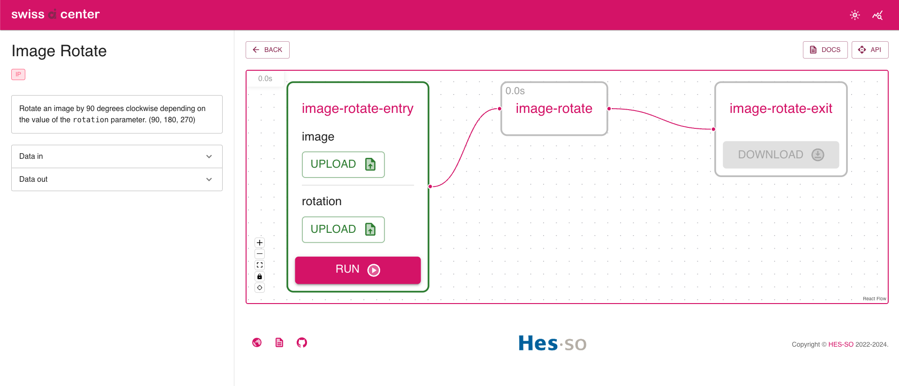

# Implement a generic service

This tutorial shows how to implement a
[Service](../reference/core-concepts/service.md) in the Swiss AI Center project
step by step. The [Service](../reference/core-concepts/service.md) is a simple image rotation tool that
rotates the image by 90, 180, 270 degrees clockwise depending on the value of the `rotation` parameter.

!!! Info
    Note that a [Service](../reference/core-concepts/service.md) can be implemented
    in any programming language as long as it follows the
    [specifications](../reference/core-concepts/service.md/#specifications) of the
    Swiss AI Center project. This tutorial is using Python 3.10.

## Tutorial

### Prerequisites

To follow this tutorial, you need to have the following tools installed:

- [Python 3.10](https://www.python.org/downloads/)
- An IDE (e.g. [Visual Studio Code](https://code.visualstudio.com/))

### Prepare the development environment

#### Launch the Core engine

To be able to test the [Service](../reference/core-concepts/service.md) locally when it is ready, 
you need to have a running [Core engine](../reference/core-engine/). 
To do so, follow the instructions in the 
[Core engine](../reference/core-engine.md#start-the-service-locally-with-minikube-and-the-docker-image-hosted-on-github) reference.

#### Get the source code

!!! Info
    In this tutorial, we will implement a
    [Service](../reference/core-concepts/service.md) that does not require a model,
    so we will use the `create-a-new-service-generic-template` template.

First, you can create a repo from the [template](https://github.com/swiss-ai-center/create-a-new-service-generic-template)
by clicking on the `Use this template` button. You can also fork it or download it.

Once the repo is created, you can clone it on your computer. (If you downloaded it, you can skip this step.)

```bash
git clone
```

Open your terminal and go to the folder where the source code is located.

```bash
cd path/to/the/source/code
```

#### Create a virtual environment

Instead of installing the dependencies globally, it is recommended to create a
virtual environment.

To create a virtual environment, run the following command inside the project
folder:

```sh
python3.10 -m venv .venv
```

Then, activate the virtual environment:

```sh
source .venv/bin/activate
```

#### Install the dependencies

For the [Service](../reference/core-concepts/service.md) to work we will need to
install numpy and opencv-python in addition to the dependencies of the template.
So edit the `requirements.txt` file and add the following lines:

```txt hl_lines="2 3"
common-code[test] @ git+https://github.com/swiss-ai-center/common-code.git@main
numpy==1.24.1
opencv-python==4.7.0.72
```

Then, install the dependencies:

```sh
pip install --requirement requirements.txt
```

Create a freeze file to list the dependencies with their versions.

```sh
pip freeze --local --all > requirements-all.txt
```

This will install the default [Service](../reference/core-concepts/service.md)
dependencies and the ones we just added. The freeze file will be used to ensure
all the developers have the same dependencies.

#### Implement the service

##### Update the README

Open the `README.md` file and update the title and the description of the
[Service](../reference/core-concepts/service.md).

```md
# Image Rotate

This service rotates an image by 90, 180 or 270 degrees clockwise.
```

!!! note

    If the service is part of the Swiss AI Center GitHub organization also add a
    link to the [Service](../reference/core-concepts/service.md)'s
    [Reference](../reference/core-concepts/service.md) page in the repository
    README.md file.

    ```md
    # Image Rotate

    This service rotates an image by 90, 180 or 270 degrees clockwise.

    _Check the [related documentation](https://swiss-ai-center.github.io/swiss-ai-center/reference/image-rotate) for more information._
    ```

##### Update the service pyproject title

```toml hl_lines="3"
[project]
# TODO: 1. CHANGE THE NAME OF THE PROJECT (1)!
name = "image-rotate"

[tool.pytest.ini_options]
pythonpath = [".", "src"]
addopts = "--cov-config=.coveragerc --cov-report xml --cov-report term-missing --cov=./src"
```

1. Change the name of the project to `image-rotate`.

##### Update the service code

All the code of the [Service](../reference/core-concepts/service.md) is in the
`main.py` file. The [Service](../reference/core-concepts/service.md) is a simple
image rotation service that rotates the image by 90, 180, 270 degrees clockwise
depending on the value of the `rotation` parameter.

Open the `main.py` with your favorite editor and follow the instructions below.

```py hl_lines="23-24 32-34 43-44 50-63 68-95 99-103 108-116"
import asyncio
import time
from fastapi import FastAPI
from fastapi.middleware.cors import CORSMiddleware
from fastapi.responses import RedirectResponse
from common_code.config import get_settings
from pydantic import Field
from common_code.http_client import HttpClient
from common_code.logger.logger import get_logger
from common_code.service.controller import router as service_router
from common_code.service.service import ServiceService
from common_code.storage.service import StorageService
from common_code.tasks.controller import router as tasks_router
from common_code.tasks.service import TasksService
from common_code.tasks.models import TaskData
from common_code.service.models import Service
from common_code.service.enums import ServiceStatus
from common_code.common.enums import FieldDescriptionType, ExecutionUnitTagName, ExecutionUnitTagAcronym
from common_code.common.models import FieldDescription, ExecutionUnitTag

# Imports required by the service's model
# TODO: 1. ADD REQUIRED IMPORTS (ALSO IN THE REQUIREMENTS.TXT) (1)!
import cv2
import numpy as np
from common_code.tasks.service import get_extension

settings = get_settings()


class MyService(Service):
    # TODO: 2. CHANGE THIS DESCRIPTION (2)!
    """
    Image rotate model
    """

    # Any additional fields must be excluded for Pydantic to work
    model: object = Field(exclude=True)
    logger: object = Field(exclude=True)

    def __init__(self):
        super().__init__(
            # TODO: 3. CHANGE THE SERVICE NAME AND SLUG (3)!
            name="Image Rotate",
            slug="image-rotate",
            url=settings.service_url,
            summary=api_summary,
            description=api_description,
            status=ServiceStatus.AVAILABLE,
            # TODO: 4. CHANGE THE INPUT AND OUTPUT FIELDS, THE TAGS AND THE HAS_AI VARIABLE (4)!
            data_in_fields=[
                FieldDescription(name="image", type=[FieldDescriptionType.IMAGE_PNG, FieldDescriptionType.IMAGE_JPEG]),
                FieldDescription(name="rotation", type=[FieldDescriptionType.TEXT_PLAIN]),
            ],
            data_out_fields=[
                FieldDescription(name="result", type=[FieldDescriptionType.IMAGE_PNG, FieldDescriptionType.IMAGE_JPEG]),
            ],
            tags=[
                ExecutionUnitTag(
                    name=ExecutionUnitTagName.IMAGE_PROCESSING,
                    acronym=ExecutionUnitTagAcronym.IMAGE_PROCESSING
                ),
            ],
            has_ai=False
        )
        self.logger = get_logger(settings)

    # TODO: 5. CHANGE THE PROCESS METHOD (CORE OF THE SERVICE) (5)!
    def process(self, data):
        # NOTE that the data is a dictionary with the keys being the field names set in the data_in_fields
        raw = data["image"].data
        input_type = data["image"].type
        rotation = data["rotation"].data

        if len(rotation) == 0:
            rotation = 90
        else:
            rotation = int(rotation)

        # Decode the image
        img = cv2.imdecode(np.frombuffer(raw, np.uint8), 1)

        # Rotate the image
        for i in range(int(rotation / 90)):
            img = cv2.rotate(img, cv2.ROTATE_90_CLOCKWISE)
        # Encode the image with the same format as the input
        guessed_extension = get_extension(input_type)
        is_success, out_buff = cv2.imencode(guessed_extension, img)

        # NOTE that the result must be a dictionary with the keys being the field names set in the data_out_fields
        return {
            "result": TaskData(
                data=out_buff.tobytes(),
                type=input_type,
            )
        }


# TODO: 6. CHANGE THE API DESCRIPTION AND SUMMARY (6)!
api_description = """
Rotate an image by 90 degrees clockwise depending on the value of the `rotation` parameter. (90, 180, 270)
"""
api_summary = """
Rotate an image by 90 degrees clockwise.
"""

# Define the FastAPI application with information
# TODO: 7. CHANGE THE API TITLE, VERSION, CONTACT AND LICENSE (7)!
app = FastAPI(
    title="Image Rotate API.",
    description=api_description,
    version="1.0.0",
    contact={
        "name": "Swiss AI Center",
        "url": "https://swiss-ai-center.ch/",
        "email": "info@swiss-ai-center.ch",
    },
    swagger_ui_parameters={
        "tagsSorter": "alpha",
        "operationsSorter": "method",
    },
    license_info={
        "name": "GNU Affero General Public License v3.0 (GNU AGPLv3)",
        "url": "https://choosealicense.com/licenses/agpl-3.0/",
    },
)
...
```

1. Import the OpenCV library and the get_extension function from the tasks
   service. This function is used to guess the extension of the image based on the
   input type.
2. Change the description of the service.
3. Change the name and the slug of the service. This is used to identify the
   service in the Core engine.
4. Change the input/output fields of the service. The name of the field is the
   key of the dictionary that will be used in the process function. The type of the
   field is the type of the data that will be sent to the service. They are defined
   in the FieldDescriptionType enum. The tags are used to identify the service in
   the Core engine. The `has_ai` variable is used to identify if the service is an
   AI service.
5. Change the process function. This is the core of the service. The data is a
   dictionary with the keys being the field names set in the data_in_fields. The
   result must be a dictionary with the keys being the field names set in the
   data_out_fields.
6. Change the API description and summary.
7. Change the API title, version, contact and license.

!!! Note
    The `process` function TaskData object must be serializable.

##### Dockerfile

The Dockerfile is used to build the Docker image of the
[Service](../reference/core-concepts/service.md). We need to add some packages
in order to use the OpenCV library.

```dockerfile hl_lines="6"
# Base image
FROM python:3.10

# Install all required packages to run the model
# TODO: 1. Add any additional packages required to run your model (1)!
RUN apt update && apt install --yes ffmpeg libsm6 libxext6
...
```

1. Add any additional packages required to run your model.

#### Test the service

Now that the service is ready, we can test it.

##### Test the service using the test scripts

Open a terminal, navigate to the `src` folder and run the following
command:

```bash
pytest --cov-report term:skip-covered --cov-report term-missing --cov=. -s --cov-config=.coveragerc
```

All the tests should pass.

```bash
======================== test session starts =========================
--------- coverage: platform darwin, python 3.10.10-final-0 ----------
Name                        Stmts   Miss  Cover   Missing
---------------------------------------------------------
src/main.py                    70     11    84%   53-70
src/tests/test_storage_service.py      83     12    86%   13-18, 24-30, 114-115
---------------------------------------------------------
TOTAL                         188     23    88%

4 files skipped due to complete coverage.


========================= 5 passed in 29.12s =========================
```

##### Test the service using the Core engine

In order to test the [Service](../reference/core-concepts/service.md), you need
to have a running [Core engine](../reference/core-engine.md#start-the-service-locally-with-minikube-and-the-docker-image-hosted-on-github).
If not done yet, follow the instructions in the
[Core engine](../reference/core-engine.md#start-the-service-locally-with-minikube-and-the-docker-image-hosted-on-github)
reference.

Once the [Core engine](../reference/core-engine/) is running, you can start the
[Service](../reference/core-concepts/service.md) by running the following
command:

```bash
uvicorn main:app --reload --host localhost --port 9090 # (1)!
```

1. The port must be the same as the one defined in the `.env` file and different
   from the one used by the Core engine.

The output should be similar to the following:

```bash
INFO:     Uvicorn running on http://127.0.0.1:9090 (Press CTRL+C to quit)
INFO:     Started reloader process [20195] using StatReload
INFO:     Started server process [20197]
INFO:     Waiting for application startup.
INFO:     [2024-01-05 14:36:21,212]  [common_code.service.service]: 	Started tasks service
DEBUG:    [2024-01-05 14:36:21,212]  [common_code.service.service]: 	Announcing service: {'name': 'Image Rotate', 'slug': 'image-rotate', 'url': 'http://localhost:9090', 'summary': '\nRotate an image by 90 degrees clockwise.\n', 'description': '\nRotate an image by 90 degrees clockwise depending on the value of the `rotation` parameter. (90, 180, 270)\n', 'status': 'available', 'data_in_fields': [{'name': 'image', 'type': ['image/png', 'image/jpeg']}, {'name': 'rotation', 'type': ['text/plain']}], 'data_out_fields': [{'name': 'result', 'type': ['image/png', 'image/jpeg']}], 'tags': [{'name': 'Image Processing', 'acronym': 'IP'}], 'has_ai': False}
DEBUG:    [2024-01-05 14:36:21,213]  [common_code.service.service]: 	url: http://localhost:8080
INFO:     [2024-01-05 14:36:21,215]  Application startup complete.
INFO:     [2024-01-05 14:36:21,286]   127.0.0.1:52362 - "GET /status HTTP/1.1" 200 OK
INFO:     [2024-01-05 14:36:21,313]  [common_code.service.service]: 	Successfully announced to the engine
```

Now, you can test the [Service](../reference/core-concepts/service.md) by
sending a request to the [Core engine](../reference/core-engine/). To do so, open your browser and navigate
to the following URL: `http://localhost:8080/`. You should see the following
page:


Now you can test the [Service](../reference/core-concepts/service.md) by
uploading an image and selecting the rotation. Create a file called rotation.txt
and add the following content:

```txt
90
```

Now, you can unfold the `/image-rotate` endpoint and click on the Try it out
button. Now upload the image and the rotation file and click on the Execute
button. The response body should be something similar to the following:

```json hl_lines="12"
{
  "created_at": "2024-01-05T14:34:48.520282",
  "updated_at": "2024-01-05T14:38:48.979189",
  "data_in": [
    "ace30502-7274-496e-b332-74e0e4c41e68.jpg",
    "316044be-015b-4640-bf92-fd15c6cd2296.txt"
  ],
  "data_out": null,
  "status": "pending",
  "service_id": "943f8f35-e688-4431-a426-90addbaa56c0",
  "pipeline_execution_id": null,
  "id": "056c3d3a-fc34-47b9-aa64-e233e1adc490",
  "service": {
    "created_at": "2024-01-05T14:34:48.520282",
    "updated_at": "2024-01-05T14:36:21.279182",
    "description": "\nRotate an image by 90 degrees clockwise depending on the value of the `rotation` parameter. (90, 180, 270)\n",
    "status": "available",
    "data_in_fields": [
      {
        "name": "image",
        "type": [
          "image/png",
          "image/jpeg"
        ]
      },
      {
        "name": "rotation",
        "type": [
          "text/plain"
        ]
      }
    ],
    "data_out_fields": [
      {
        "name": "result",
        "type": [
          "image/png",
          "image/jpeg"
        ]
      }
    ],
    "tags": [
      {
        "name": "Image Processing",
        "acronym": "IP"
      }
    ],
    "has_ai": false,
    "id": "943f8f35-e688-4431-a426-90addbaa56c0",
    "name": "Image Rotate",
    "slug": "image-rotate",
    "summary": "\nRotate an image by 90 degrees clockwise.\n",
    "url": "http://localhost:9090"
  },
  "pipeline_execution": null
}
```

Now, copy the id of the task and unfold the GET `/tasks/{task_id}` endpoint
under the Tasks name.

1. Click on Try it out and paste the id in the task_id field.
2. Click on Execute.
3. In the body response, find the `data_out` field and copy the id of the image
   (e.g. `a38ef233-ac01-431d-adc8-cb6269cdeb71.png`).
4. Now, unfold the GET `/storage/{key}` endpoint under the Storage name.
5. Click on Try it out and paste the id of the image in the key field.
6. Click on Execute.
7. Click on the Download file button and save the image in your computer.

The image should be rotated by 90 degrees.

##### Test the service using the Core engine Frontend

In order to test the [Service](../reference/core-concepts/service.md) with the frontend, you need to launch the [Core engine](../reference/core-engine/#start-the-service-locally-with-node) Frontend. To do so, follow the instructions in the [Core engine](../reference/core-engine/#start-the-service-locally-with-node) reference.

Once the [Core engine](../reference/core-engine/#start-the-service-locally-with-node) Frontend is running, you can start the [Service](../reference/core-concepts/service.md) by running the following command:

```bash
uvicorn main:app --reload --host localhost --port 9090 # (1)!
```

1. The port must be the same as the one defined in the `.env` file and different
   from the one used by the Core engine.

!!! Note
    The [Core engine](../reference/core-engine/#start-the-service-locally-with-node) Frontend needs a running [Core engine](../reference/core-engine/) to work.

As in the previous section, you can test the [Service](../reference/core-concepts/service.md) by sending a request to the [Core engine](../reference/core-engine/). To do so, open your browser and navigate to the following URL: `http://localhost:3000/`. You should see the following page:


Now you can test the [Service](../reference/core-concepts/service.md) by clicking the `View` button. Now upload the image and the rotation file and click on the `Run` button.



The execution should start and as soon as it is finished, the `Download` button should be clickable. Use it to download the result.


The image should be rotated by 90 degrees.

!!! success "Congratulations!"
    You have successfully created a [Service](../reference/core-concepts/service.md)
    and tested it locally. Now, you can push the
    [Service](../reference/core-concepts/service.md) to GitHub and deploy it on the
    [Core engine](../reference/core-engine/) using the workflow from the repo.