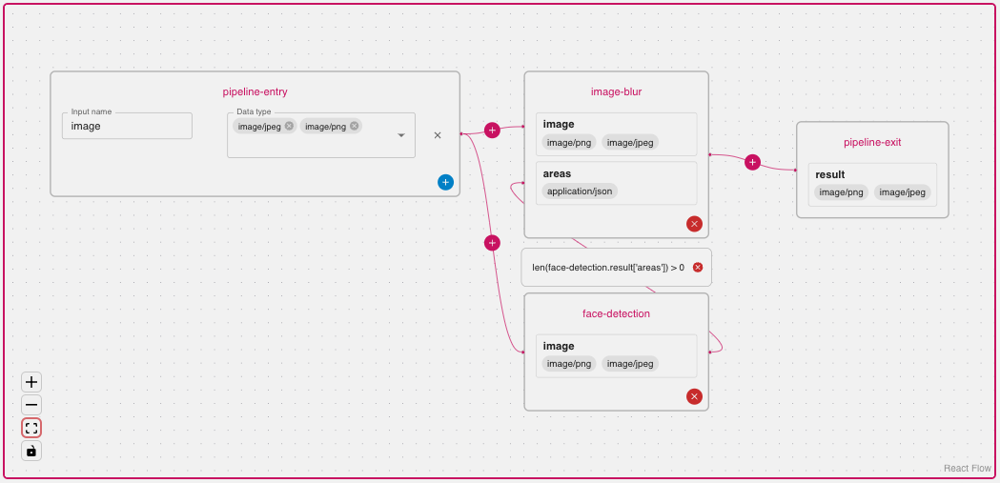

<!--
theme: uncover
size: 16:9
paginate: true
author: Swiss AI Center contributors
title: 'Core Engine - Presentation'
description: 'Presentation of the Swiss AI Center project Core Engine'
url: https://docs.swiss-ai-center.ch/presentation/
footer: '**Swiss AI Center** - 2022-2024 - AGPL 3.0'
style: |
    blockquote {
        font-style: italic;
    }
    table {
        width: 100%;
    }
    th:first-child {
        width: 15%;
    }
    h1, h2, h3, h4, h5, h6 {
        color: var(--color-headings);
    }
    h2, h3, h4, h5, h6 {
        text-transform: uppercase;
        font-size: 1.5rem;
    }
    h1 a:link, h2 a:link, h3 a:link, h4 a:link, h5 a:link, h6 a:link {
        text-decoration: none;
    }
    hr {
        border: 1px solid var(--color-foreground);
        margin-top: 50px;
        margin-bottom: 50px
    }
    .center {
        text-align: center;
    }
    .left-text{
        text-align: left;
    }
    .normal-text {
        text-align: justify;
    }
headingDivider: 4
-->
[illustration]: ./images/logo.png
[license]: https://github.com/swiss-ai-center/core-engine/blob/main/LICENSE
[website]: https://swiss-ai-center.ch
[website-qrcode]:
    https://quickchart.io/qr?format=png&ecLevel=Q&size=400&margin=1&text=https://swiss-ai-center.ch
[github]: https://github.com/swiss-ai-center/core-engine
[documentation]: https://docs.swiss-ai-center.ch/core-engine/
[guide]: https://mlops.swiss-ai-center.ch/

# Core Engine

<!--
_class: lead
_paginate: false
-->

[Website][website] · [GitHub][github] · [Documentation][documentation] · [Guide][guide]

<small>Swiss AI Center contributors</small>

<small>This work is licensed under the [AGPL 3.0][license] license.</small>

## Introduction

<!--
_class: lead
_paginate: false
-->

## Swiss AI Center

<!-- _class: normal-text -->
<small>

- **Five schools from the HES-SO**
(HEIG-VD, HEIA-FR, HE-Arc, HEVS and HEPIA)
- Project called **Centre Suisse d’Intelligence Artificiel à destination des PMEs (CSIA-PME)**, also known as the **Swiss AI Center**.
- The center’s mission is to **accelerate the adoption of artificial
intelligence in the digital transition of Swiss SMEs**.

</small>

## Features

<!--
_class: lead
_paginate: false
-->

---

<!-- _class: lead -->

- Centralize **ML services**
- Unify ML services specifications with a **HTTP REST API**
- **Orchestrate** multiple ML services **through pipelines**

---

- Beautiful **frontend to visualize** services and pipelines
- Extensive **documentation** available
- Best practices regarding software development (code reviews, CI/CD)
- **Open source**

## Infrastructure

<!--
_class: lead
_paginate: false
-->

---

## Service specification

<!--
_class: lead
_paginate: false
-->

---

<!-- _class: lead -->

<small>

- Can be in **any language** that can implement a **REST API**
- Must have the **required routes** to be “engine” compliant
- The /compute route must accept the **“Task” model**
- Can have its own routes (for specific purposes)
- Can be auto-scaled with **KEDA** on Kubernetes

</small>

## Pipeline specification

<!--
_class: lead
_paginate: false
-->

---

<!-- _class: lead -->

<small>

A JSON file containing base information:
- Name
- Slug
- Summary
- Description
- Input/Output
- Tags

</small>

---

<!-- _class: normal-text -->

<small>

And a list of “Steps” representing the sequel of services to run with the following data:

- **Identifier** (used in the “needs”, “conditions” and “inputs” values)
- **Needs** (used to wait until all the services in the array finished their task)

</small>

---

- **Condition** ([optional] if this specific step should match a condition before being run)
- **Inputs** (which data should be put in the entry of the service)

---

## Next steps

<!--
_class: lead
_paginate: false
-->

---

<!-- _class: lead -->

<small>

- Pipeline branching
- Pipeline multiple outputs
- Toy datasets
- And many more…

</small>

## Any questions? 😄

<!--
_class: lead
_paginate: false
-->

## Useful links

<!-- _class: lead -->

<small>

- [Official website](https://swiss-ai-center.ch)
- [Documentation](https://docs.swiss-ai-center.ch)
- [Frontend demo](https://app.swiss-ai-center.ch)
- [Backend demo](https://core-engine.swiss-ai-center.ch)
- [Guide to MLOps](https://mlops.swiss-ai-center.ch)
- [Chatbot](https://chatbot.swiss-ai-center.ch)
- [GitHub](https://github.com/swiss-ai-center/)

</small>

